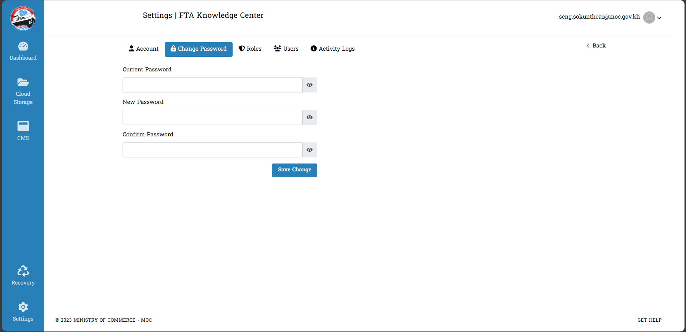

# II. Change Password

- នេះជាកន្លែងដែលអ្នកប្រើប្រាស់អាចប្តូរពាក្យសម្ងាត់ផ្ទាល់ខ្លួន :

វិធីសាស្ត្រក្នុងការ _ដាក់ពាក្យសម្ងាត់ថ្មី_ & _ផ្លាស់ប្តូរពាក្យសម្ងាត់ចាស់់_
អ្នកប្រើប្រាស់មានតួនាទីលើការកំណត់ ពាក្យសម្ងាត់ របស់ខ្លួន :

ធ្វើការចុច **Save Change** ដើម្បីទទួលយកនូវអ្វីដែលប្រើប្រាស់បានផ្លាស់ប្តូរ
  ::: warning របៀបដោះស្រាយបញ្ហា
  រាល់ការផ្លាស់ប្តូរពាក្យសំខាត់ថ្មី អ្នកប្រើប្រាស់ចាំបាច់ត្រូវដាក់ទាំំង `ពាក្យសម្ងាត់បច្ចុប្បន្ន`,  `ពាក្យសម្ងាត់ថ្មី`, `បញ្ជាក់ពាក្យសម្ងាត់ថ្មី` ដែលចង់ផ្លាស់ប្តូរ
  :::

## ១. ការមិនបញ្ចូល (Current Password, Password, Confirm Password)

::: tip វិធីសាស្ត្រដោះស្រាយក្រោយពេលមិនបានបញ្ចូលព័ត៌មានតាមការណែនាំ

- អ្នកប្រើប្រាស់នឹងទទួលបានការណែនាំមួយផ្សេងទៀត ពេលដែលចំណុចទាំងបីមិនបានបំពេញ
- សូមធ្វើតាមការណែនាំដូចមានក្នុងរូប

ជាភាសាខ្មែរ បានន័យថា :

> **សារកំហុស!** 
> **• ពាក្យសម្ងាត់បច្ចុប្បន្នត្រូវតែបញ្ចូល**  
> **• ពាក្យសម្ងាត់ថ្មីត្រូវតែបញ្ចូល**  
> **• បញ្ជាក់ពាក្យសម្ងាត់ត្រូវតែបញ្ចូល!** 

- ដើម្បីដោះស្រាយ អ្នកប្រើប្រាស់ត្រូវតែធ្វើតាមការណែនាំខាងលើ
  :::

## ២. ការដាក់ Current Password មិនបានត្រឹមត្រូវ!

::: tip វិធីសាស្ត្រដោះស្រាយពេលមានការដាក់ Current Password មិនត្រឹមត្រូវ
ការផ្លាស់ប្តូរពាក្យសម្ងាត់ថ្មីអ្នកប្រើប្រាស់ចាំបាច់បំពេញឲ្យបានត្រឹមត្រូវ `ពាក្យសម្ងាត់បច្ចុប្បន្ន` ជាមុនសិន

- សូមអានព័ត៌មានដែលបង្ហាញខាងក្រោមនេះ

- ចំពោះករណីធ្វើមិនបានត្រឹមត្រូវ ការណែនាំមួយនឹងមានបង្ហាញមក :

ជាភាសាខ្មែរ បានន័យថា :

> **សារកំហុស!** 
> **•​ ពាក្យសម្ងាត់បច្ចុប្បន្នមិនត្រឹមត្រូវទេ!**

- សូមធ្វើការវាយពាក្យសម្ងាត់ឲ្យបានត្រឹមត្រូវមុននឹងធ្វើការចង់ផ្លាស់ប្តូរ!!

:::

## ៣. ការដាក់ New Password និង Confirm Password មិនត្រូវគ្នា

::: tip វិធីសាស្ត្រដោះស្រាយពេលផ្តល់ពាក្យសម្ងាត់ថ្មី និង ការបញ្ជាក់ពាក្យសម្ងាត់ថ្មីមិនត្រឹមត្រូវ
ការផ្តល់ពាក្យសម្ងាត់ថ្មី និង​ ការបញ្ជាក់ពាក្យសម្ងាត់ថ្មី មិនដូចគ្នា នោះការផ្លាស់ប្តូរគឺមិនអាចទៅរួចនោះទេ :

- សូមអានព័ត៌មានដែលបង្ហាញខាងក្រោមនេះ

ជាភាសាខ្មែរ បានន័យថា :

> **សារកំហុស!** 
> **•​ ពាក្យសម្ងាត់ថ្មី និង បញ្ជាក់ពាក្យសម្ងាត់មិនត្រូវគ្នាទេ!**

- ដើម្បីដោះស្រាយ អ្នកប្រើប្រាស់ត្រូវតែធ្វើតាមការណែនាំខាងលើ
  :::

## ៤. ការដាក់ New Password និង Current Password ត្រូវតែមានសញ្ញា ឬ តួរអក្សរពិសេសមួយ

::: tip វិធីសាស្ត្រដោះស្រាយពេលផ្តល់ពាក្យសម្ងាត់ថ្មី និង បញ្ជាក់ពាក្យសម្ងាត់ថ្មី មិនមានអក្សរពិសេស
សម្រាប់ការដែលចង់ផ្លាស់ប្តូរពាក្យសម្ងាត់ថ្មី អ្នកប្រើប្រាស់ត្រូវធ្វើការដាក់អក្សរពិសេសមួយ **(, . / '' "" \* @ # $ - + | \ % ^ &)** ជាការចាំបាច់ និងមានសញ្ញាផ្សេងៗជាច្រើនទៀត ។

- សូមអានព័ត៌មានដែលបង្ហាញខាងក្រោមនេះ

ជាភាសាខ្មែរ បានន័យថា :

> **សារកំហុស!** 
> **• ពាក្យសម្ងាត់ត្រូវមានសញ្ញាពិសេស!**

- សូមធ្វើការវាយពាក្យសម្ងាត់ឲ្យបានត្រឹមត្រូវមុននឹងធ្វើការចង់ផ្លាស់ប្តូរ!!
  :::

## ៥. ការដាក់ New Password និង Current Password ត្រូវមានតួរអក្សរធំមួយ

::: tip វិធីសាស្ត្រដោះស្រាយពេលប្តូរ ពាក្យសម្ងាត់ថ្មី និង បញ្ជាក់ពាក្យសម្ងាត់ថ្មីដោយមិនបានដាក់អក្សរធំមួយទេ
សម្រាប់ការផ្លាស់ប្តូរពាក្យសម្ងាត់ថ្មីចាំបាច់ឲ្យអ្នកប្រើប្រាស់ធ្វើការដាក់ពាក្យសម្ងាត់ថ្មី ក្នុងនោះគឺចាំបាច់ត្រូវមានអក្សរធំមួយមកជាមួយផងក្នុងនោះ ។  (ឧទាហរណ៍ : **S**okunthea)

- មេត្តាអានព័ត៌មានដែលបង្ហាញខាងក្រោមនេះ :

ជាភាសាខ្មែរ បានន័យថា :

> **សារកំហុស!** 
> **• ពាក្យសម្ងាត់យ៉ាងហោចណាស់ត្រូវមានតួរអក្សរធំមួយ!**

- សូមធ្វើតាមការណែនាំក្នុងការវាយពាក្យសម្ងាត់ដូចបានបរិយាយខាងលើ!!
  :::

## ៦. ការដាក់ New Password និង Current Password ត្រូវមានប្រវែងអក្សរអប្បបរមា ៦ តួរ

::: tip វិធីសាស្ត្រដោះស្រាយពេលប្តូរ ពាក្យសម្ងាត់ថ្មី និង បញ្ជាក់ពាក្យសម្ងាត់ថ្មី មានតួរអក្សរតិចជាង ៦
សម្រាប់ការផ្លាស់ប្តូរពាក្យសម្ងាត់ថ្មីចាំបាច់ឲ្យអ្នកប្រើប្រាស់ធ្វើការ ដាក់អក្សរនៃពាក្យសម្ងាត់ឲ្យមានប្រវែងអក្សរអប្បបរមា ៦ តួរយ៉ាងតិច ។  
(ឧទាហរណ៍: **thea@1** )

- មេត្តាអានព័ត៌មានដែលបង្ហាញខាងក្រោមនេះ :

ជាភាសាខ្មែរ បានន័យថា :

> **សារកំហុស!** 
> **• ពាក្យសម្ងាត់ត្រូវតែមានយ៉ាងហោចណាស់ 6 តួអក្សរ!!**

- សូមធ្វើតាមការណែនាំក្នុងការវាយពាក្យសម្ងាត់ដូចបានបរិយាយខាងលើ!!
  :::

## ៧. ការដាក់ New Password និង Current Password ត្រឹមត្រូវ​! ✔

::: tip វិធីសាស្ត្រដើម្បីដឹងពីត្រឹមត្រូវ
ចំពោះបញ្ហាទាំងប៉ុន្មានអ្នកប្រើប្រាស់បំពេញបានត្រឹមត្រូវគ្រប់លក្ខខណ្ឌដោយមិនបានធ្វើខុសទេ នោះច្បាស់ណាស់ភាពត្រឹមត្រូវនឹងមានឡើង

- មេត្តាអានព័ត៌មានដែលបង្ហាញខាងក្រោមនេះ :

:::

