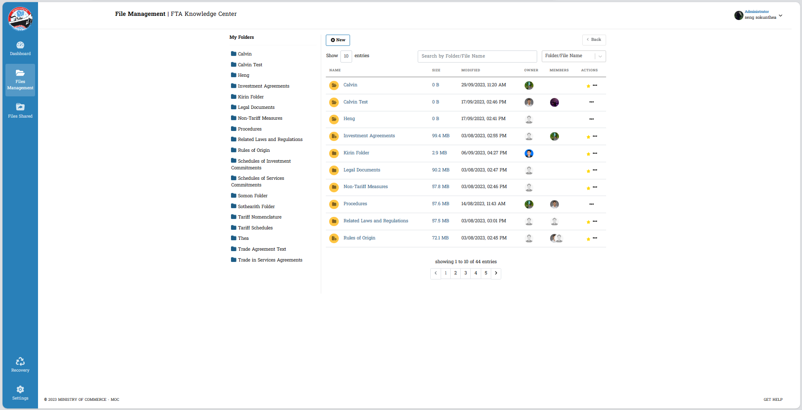
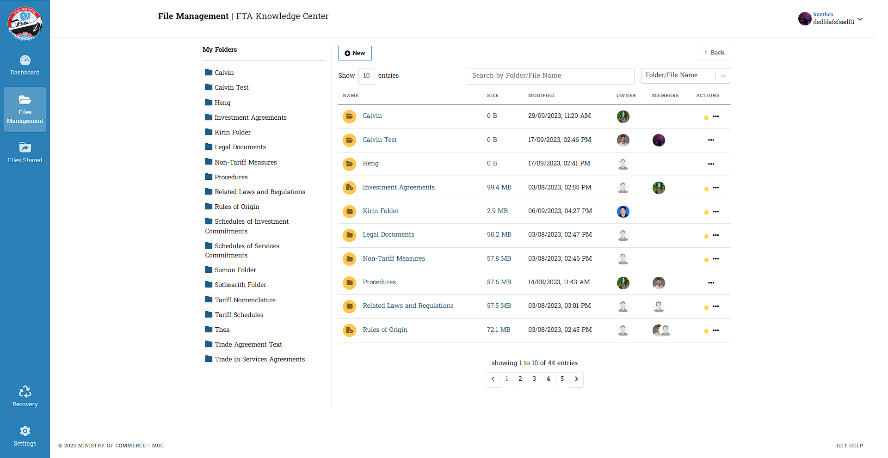
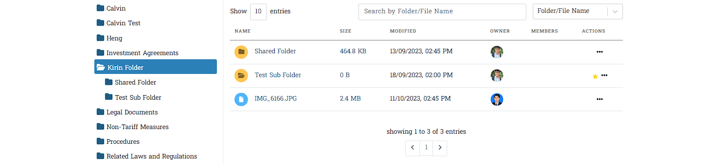
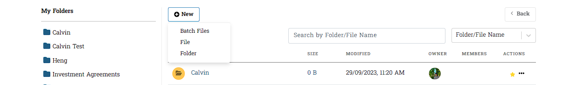
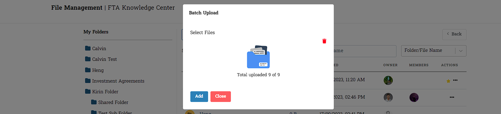

# I. File Management នៅក្នុង Settings

&nbsp;&nbsp;&nbsp;&nbsp;&nbsp;&nbsp;&nbsp;&nbsp;នេះគឺជា File Management ដែលមាននៅផ្ទាំងខាងឆ្វេងវាជាមធ្យោបាយដែលសម្រួលដល់ការស្វែងយល់ក្នុងការកំណត់ព័ត៌មានអ្នកប្រើប្រាស់អំពីថតឯកសាររបស់ខ្លួន និង តារាងបង្ហាញថត រួមជាមួយនឹងឯកសារ ។

## ១. ការចូលទៅកាន់ File Management
&nbsp;&nbsp;&nbsp;&nbsp;&nbsp;&nbsp;&nbsp;&nbsp;នៅពេលអ្នកប្រើប្រាស់ចុចលើជម្រើស `File Management` នៅក្នុងរបារចំហៀង វាបានបង្ហាញដូចខាងក្រោម :

::: warning ចំណាំ
នេះជាព័ត៌មានរបស់អ្នកប្រើប្រាស់តែប៉ុណ្ណោះ សម្រាប់ Admin ចាំបាច់ត្រូវធ្វើការកំណត់រាល់ចំណុចដែលមានក្នុង  `User Permission` និង `User Interface` ជាមុនសិន ។
:::

## ២. ព័ត៌មានក្នុង My Folders
&nbsp;&nbsp;&nbsp;&nbsp;&nbsp;&nbsp;&nbsp;&nbsp;នៅពេលអ្នកប្រើប្រាស់ចុចលើថតមួយក្នុងផ្នែក **My Folder** រំពឹងថានឹងឃើញថតរង ដែលមាននៅក្នុងថតនោះ ។ លើសពីនេះទៀត អ្នកប្រើប្រាស់នឹងត្រូវបានបញ្ជូនបន្តទៅកាន់ទិដ្ឋភាពតារាងដែលបង្ហាញមាតិកានៃថតដែលបានជ្រើសរើស ។

- នៅពេលដែលអ្នកប្រើប្រាស់ចុចលើថតផ្សេងៗទៀតនៅក្នុងផ្នែក **My Folder** បន្ទាប់ពីជ្រើសរើសថតណាមួយ។ ព័ត៌មានចាប់ផ្តើមមានបង្ហាញចេញនូវផ្នែកថតតូចៗ *Show Entries* មួយចំនួនមកកាន់អ្នកប្រើប្រាស់ឲ្យបានឃើញ ។ ចំពោះផ្នែកខាងស្តាំនេះផងដែរបានបង្ហាញឲ្យឃើញធាតុ និងមុខងារជាច្រើនដែលមាន ។ ទាំងនេះរួមមានប៊ូតុងថយក្រោយ ប៊ូតុងបន្ថែម មុខងារស្វែងរក មុខងារស្វែងរកតាមប្រភេទ និងតារាងបង្ហាញថតឯកសារ។

>របៀបស្វែងយល់បន្ថែម
> - ចុចលើថត Folder ណាមួយ
> - Folders មួយចំនួនមានបង្ហាញ
> - ផ្នែកខាងស្តាំមានបង្ហាញនូវព័ត៌មានជា Files ផ្សេងៗ ។

## ៣. ព័ត៌មានក្នុងប៊ូតុង New 

## ៤. ការដំណើរការរបស់ Batch Upload
&nbsp;&nbsp;&nbsp;&nbsp;&nbsp;&nbsp;&nbsp;&nbsp;នេះជាផ្នែកដែលមានដំណើរការចូលទៅកាន់ការ​ *Add* ព័ត៌មានផ្សេងៗ ក្នុងប៊ុតុង *New* ដែលក្នុងនេះមានព័ត៌មានចំនួន ៣ ត្រូវបានបង្ហាញចេញ ។ សម្រាប់ **Batch Upload** មានតួនាទីធ្វើការផ្ទុកឡើងនូវព័ត៌មានដែលមាន**ចំនួនច្រើនលើសពី ២ ឡើងទៅ** ។

>របៀបស្វែងយល់បន្ថែម
> - ចុច Upload Files 
> - ចុច Add 
- ព័ត៌មានបានបញ្ជូនចូលក្នុង File Management របស់លោកអ្នក

::: tip
:::