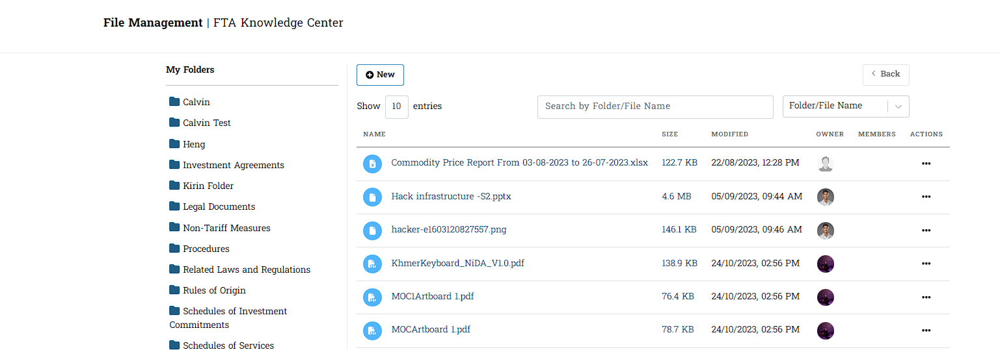
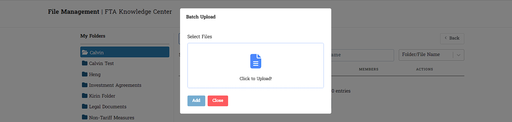
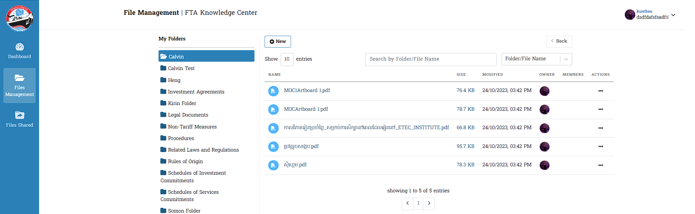
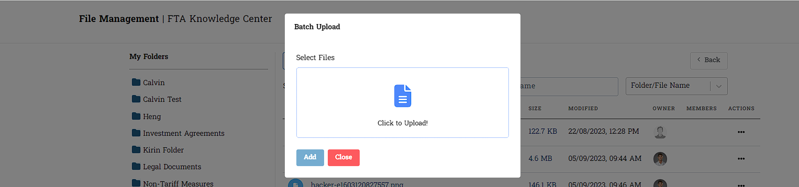

# I. File Management នៅក្នុង Settings

&nbsp;&nbsp;&nbsp;&nbsp;&nbsp;&nbsp;&nbsp;&nbsp;នេះគឺជា File Management ដែលមាននៅផ្ទាំងខាងឆ្វេងវាជាមធ្យោបាយដែលសម្រួលដល់ការស្វែងយល់ក្នុងការកំណត់ព័ត៌មានអ្នកប្រើប្រាស់អំពីថតឯកសាររបស់ខ្លួន និង តារាងបង្ហាញថត រួមជាមួយនឹងឯកសារ ។

## ១. ការចូលទៅកាន់ File Management
&nbsp;&nbsp;&nbsp;&nbsp;&nbsp;&nbsp;&nbsp;&nbsp;នៅពេលអ្នកប្រើប្រាស់ចុចលើជម្រើស `File Management` នៅក្នុងរបារចំហៀង វាបានបង្ហាញដូចខាងក្រោម :

::: warning ចំណាំ
នេះជាព័ត៌មានរបស់អ្នកប្រើប្រាស់តែប៉ុណ្ណោះ សម្រាប់ Admin ចាំបាច់ត្រូវធ្វើការកំណត់រាល់ចំណុចដែលមានក្នុង  `User Permission` និង `User Interface` ជាមុនសិន ។
:::

## ២. ព័ត៌មានក្នុង My Folders
&nbsp;&nbsp;&nbsp;&nbsp;&nbsp;&nbsp;&nbsp;&nbsp;នៅពេលអ្នកប្រើប្រាស់ចុចលើថតមួយក្នុងផ្នែក **My Folder** រំពឹងថានឹងឃើញថតរង ដែលមាននៅក្នុងថតនោះ ។ លើសពីនេះទៀត អ្នកប្រើប្រាស់នឹងត្រូវបានបញ្ជូនបន្តទៅកាន់ទិដ្ឋភាពតារាងដែលបង្ហាញមាតិកានៃថតដែលបានជ្រើសរើស ។

- នៅពេលដែលអ្នកប្រើប្រាស់ចុចលើថតផ្សេងៗទៀតនៅក្នុងផ្នែក **My Folder** បន្ទាប់ពីជ្រើសរើសថតណាមួយ។ ព័ត៌មានចាប់ផ្តើមមានបង្ហាញចេញនូវផ្នែកថតតូចៗ *Show Entries* មួយចំនួនមកកាន់អ្នកប្រើប្រាស់ឲ្យបានឃើញ ។ ចំពោះផ្នែកខាងស្តាំនេះផងដែរបានបង្ហាញឲ្យឃើញធាតុ និងមុខងារជាច្រើនដែលមាន ។ ទាំងនេះរួមមានប៊ូតុងថយក្រោយ ប៊ូតុងបន្ថែម មុខងារស្វែងរក មុខងារស្វែងរកតាមប្រភេទ និងតារាងបង្ហាញថតឯកសារ។

>របៀបស្វែងយល់បន្ថែម
> - ចុចលើថត Folder ណាមួយ
> - Folders មួយចំនួនមានបង្ហាញ
> - ផ្នែកខាងស្តាំមានបង្ហាញនូវព័ត៌មានជា Files ផ្សេងៗ ។

## ៣. ព័ត៌មានក្នុងប៊ូតុង New 

## ៤. ការដំណើរការរបស់ Batch Upload
&nbsp;&nbsp;&nbsp;&nbsp;&nbsp;&nbsp;&nbsp;&nbsp;នេះជាផ្នែកដែលមានដំណើរការចូលទៅកាន់ការ​ *Add* ព័ត៌មានផ្សេងៗ ក្នុងប៊ូតុង *New* ដែលក្នុងនេះមានព័ត៌មានចំនួន ៣ ត្រូវបានបង្ហាញចេញ ។ សម្រាប់ **Batch Upload** មានតួនាទីធ្វើការផ្ទុកឡើងនូវព័ត៌មានដែលមាន**ចំនួនច្រើនលើសពី ២ ឡើងទៅ** ។

 - ចុច Click to upload ដែលជាកន្លែងដែលអ្នកប្រើប្រាស់អាចជ្រើសរើសឯកសារ ដូចជាឯកសារដែលមានផ្នែកបន្ថែម **.rar** ឬ **.zip** និងឯកសារ **alot** ក្នុងពេលតែមួយ
 - ចុច Add ដើម្បីបន្ថែមដែលត្រូវបានបិទដំបូង
 - ចុច Close ដើម្បីបិទប្រអប់
> ព័ត៌មានបានបញ្ចូលចូលក្នុង *File Management* របស់លោកអ្នក

*ព័ត៌មានក្នុង ប្រអប់បញ្ជីធំ*

## ៤. ការបង្ហាញចេញក្រោយ Upload File ក្នុង Batch Upload
&nbsp;&nbsp;&nbsp;&nbsp;&nbsp;&nbsp;&nbsp;&nbsp;នៅពេលចុចប៊ូតុង *Add* ឯកសារដែលបានជ្រើសរើសនឹងត្រូវបានរក្សាទុក បង្ហាញការជូនដំណឹងជាបាច់ដែលបានបញ្ចប់ ហើយអ្នកប្រើប្រាស់នឹងត្រូវបានបញ្ជូនបន្តទៅទិដ្ឋភាពបញ្ជីតារាង ។

### ក្នុងថតរបស់ Folder
&nbsp;&nbsp;&nbsp;&nbsp;&nbsp;&nbsp;&nbsp;&nbsp;សូមធ្វើការផ្តល់ : 

> - ចុចប៊ូតុង Add ដោយចាំបាច់ត្រូវចូលក្នុងថត Folder ណាមួយដែលខ្លួនពេញចិត្ត 
> - ទិន្នន័យដែលបាន Add នឹងបង្ហាញនៅក្នុងថត Folder

ការបង្ហាញនៅក្នុងថត Folder ដែលអ្នកប្រើប្រាស់បានកំណត់ដាក់នោះ

### ក្នុងទិដ្ឋភាពបញ្ជីតារាងជារួម

&nbsp;&nbsp;&nbsp;&nbsp;&nbsp;&nbsp;&nbsp;&nbsp;សូមធ្វើការផ្តល់ :
> - ចុចប៊ូតុង Add ដោយចូលក្នុងថតណាមួយទេ 
> - ទិន្នន័យដែលបាន Add នោះនឹងមានបង្ហាញនៅលើតារាងបញ្ជីធំតែម្តង 

ការបង្ហាញនៅលើតារាងបញ្ជីធំ

## ៥. ការដំណើរការរបស់ File

&nbsp;&nbsp;&nbsp;&nbsp;&nbsp;&nbsp;&nbsp;&nbsp;សម្រាប់ព័ត៌មាន **File** មានតួនាទីធ្វើការផ្ទុកឡើងនូវព័ត៌មានដែលមាន**ចំនួនត្រឹមតែ ១ ប៉ុណ្ណោះ** ។ នៅពេលអ្នកប្រើប្រាស់ចុចលើជម្រើស **File** : 

- ប្រអប់នឹងរួមបញ្ចូលប្រអប់ ឬតំបន់ដែលអ្នកប្រើប្រាស់អាចចុចដើម្បីជ្រើសរើសឯកសារសម្រាប់ផ្ទុកឡើង។ ផ្នែកបន្ថែមឯកសារដែលគាំទ្រអាចរួមមាន **.rar**, **.zip**, **.png**, **.jpg**, **.xlsx**, **.pptx**, **.pdf**, **.docx** និងច្រើនទៀត
- វានឹងមាន **អត្ថបទ** ដែលអ្នកប្រើប្រាស់អាចបញ្ចូលការពិពណ៌នា ឬព័ត៌មានបន្ថែមអំពីឯកសារដែលបានផ្ទុកឡើង
- ប្រអប់នឹងរួមបញ្ចូលផងដែរនូវប៊ូតុង *Add* ដើម្បីបន្ថែមឯកសារដែលបានជ្រើសរើសសម្រាប់ការផ្ទុកឡើង និងប៊ូតុង *Close* ដើម្បីច្រានចោល ឬបិទប្រអប់។

>របៀបធ្វើការ
> - ចុច Click to upload! ដែលជាកន្លែងដែលអ្នកប្រើប្រាស់អាចជ្រើសរើសឯកសារ  **.rar**, **.zip**, **.png**, **.jpg**, **.xlsx**, **.pptx**, **.pdf**, **.docx** និងច្រើនទៀត
> - ចុច Add ដើម្បីបន្ថែមដែលត្រូវបានបិទដំបូង
> - ចុច Close ដើម្បីបិទប្រអប់

- ព័ត៌មានបានបញ្ចូលចូលក្នុង *File Management* របស់លោកអ្នក

