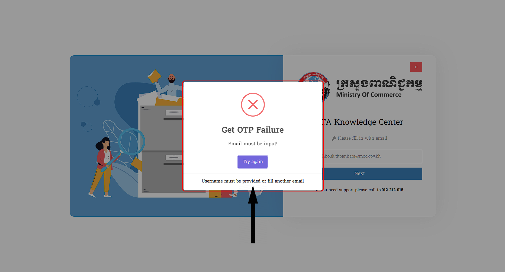

# II. ព័ត៌មានក្នុង Forgot Password
នេះគឺជាព័ត៌មានទាំងអស់សម្រាប់អ្នកប្រើប្រាស់ក្នុងការស្វែងយល់បន្ថែមពីក្នុងចំណុច Forgot Password : 

## ១. ការដែលមិនបានដាក់ Email ចូល
::: tip ករណីអ្នកប្រើប្រាស់ភ្លេចទាំង Password និង Username ក្នុងការចូលប្រព័ន្ធ
អ្នកប្រើប្រាស់តម្រូវឲ្យធ្វើតាមដំណាក់កាលនេះជាមុនសិន:

- អ្នកប្រើប្រាស់ធ្វើការ ចុចលើចំណុចដែលមានឈ្មោះថា `Forgot Password` 
- ដំណើរការនៃប្រព័ន្ធបានចូលទៅកាន់ ទីតាំងមួយទៀតដែល អ្នកប្រើប្រាស់អាចធ្វើវិធីផ្សេងដើម្បីចូលប្រើប្រាស់ប្រព័ន្ធ
- អ្នកប្រើប្រាស់អាចធ្វើការដាក់ *Domain (@moc.gov.kh)* ដើម្បីចូលទៅកាន់ប្រព័ន្ធ 

 >សម្រាប់ការបញ្ចូលពាក្យសម្ងាត់មិនមានភាពច្បាស់លាស់ទៅតាមអ្វីដែលមាននោះ ក្រោយពីធ្វ់ើការចុច `Log in` នឹងមានពាក្យថា **Email must be input** នៅខាងក្រោមពាក្យ *Get OTP Failure*

 
:::

## ២.​ ការដាក់ Email មិនត្រឹមត្រូវ

::: tip ករណីអ្នកប្រើប្រាស់ដាក់ត្រឹមតែឈ្មោះដោយមិនបានភ្ជាប់ជាមួយ Email របស់ Domain (@moc.gov.kh)
- ការដែលស្ថិតក្នុង Forgot Password តម្រូវឲ្យអ្នកប្រើប្រាស់មានការបញ្ចូលឈ្មោះ នៃ *Domain (@moc.gov.kh)*   >- ករណីអ្នកប្រើប្រាស់ដាក់ឈ្មោះមិនមានភាពត្រឹមត្រូវនោះ :

អ្នកប្រើប្រាស់បានដាក់ឈ្មោះដោយភ្ជាប់ជាមួយនឹង **Email** តែបើខុសឈ្មោះនៃរបស់វានោះបញ្ហានឹងបង្ហាញបែបនេះ : 

 >នៅពេលអ្នកប្រើប្រាស់ដាក់ឈ្មោះ Email ដែលមិនមាន ឬ ក៏មិនត្រឹមត្រូវទេ ពិតណាស់វានឹងមានបញ្ហា ក្រោយពេលអ្នកប្រើប្រាស់ធ្វើការចុច `Log in` ដោយវានឹងមានចេញពាក្យ **Email does not exist or invalid email!** នៅពីក្រោមពាក្យថា *Get OTP Failure* ដើម្បីបញ្ជាក់ថានេះមានកំហុសហើយ

:::

::: danger សូមលោកអ្នកធ្វើការវាយឡើងវិញដោយចុចលើពាក្យ​ Try again ដើម្បីទៅកាន់ទីតាំងដើមវិញ
:::