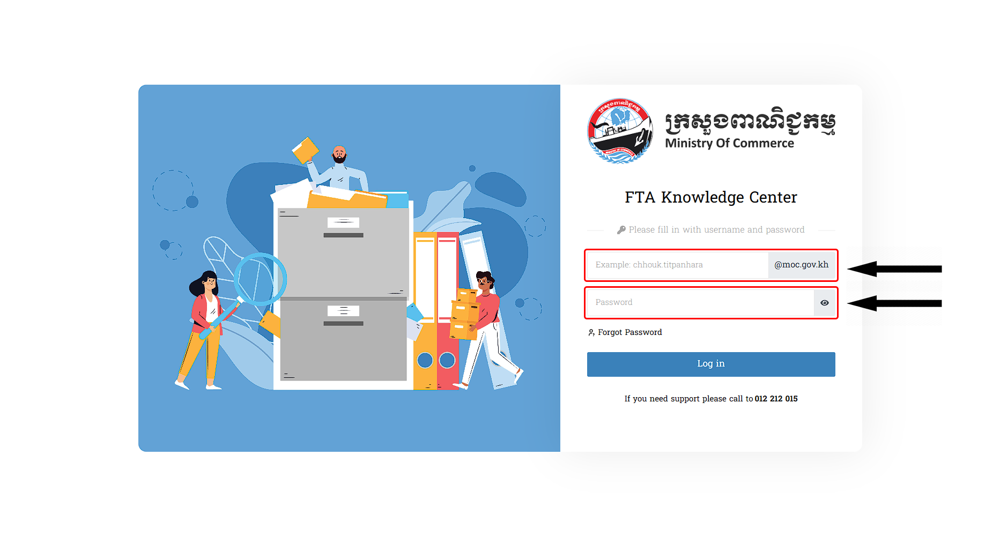
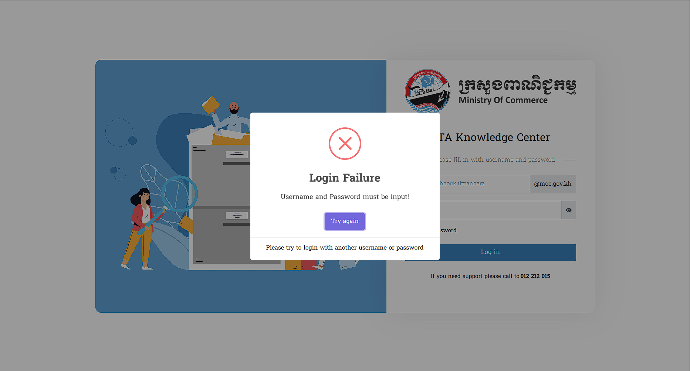
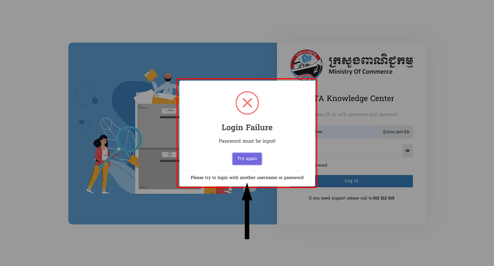
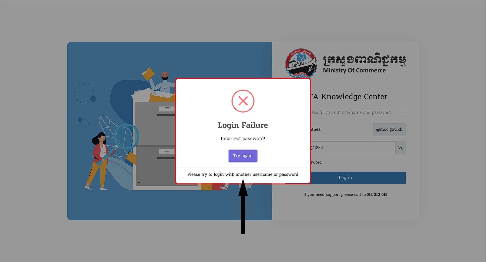

# I. ការបញ្ចូលទាំង Username & Password 
នេះគឺជាព័ត៌មានទាំងអស់សម្រាប់អ្នកប្រើប្រាស់ក្នុងការផ្តល់ជាព័ត៌មានសម្រាប់ដោះស្រាយពេលមានបញ្ហាណាមួយដែលកើតមាន ក្នុងចំណុច **Username** & **Password** :

## ១. ការមិនផ្តល់ Username និង Password
::: tip ករណីអ្នកប្រើប្រាស់មិនបានផ្តល់ឈ្មោះអ្នកប្រើប្រាស់ និងពាក្យសម្ងាត់
 > បើវាយដោយគ្មាន **(ឈ្មោះ) / Username** ហើយគ្មាន **(ពាក្យសម្ងាត់) / Password** ក្រោយចុច `Log in` នឹងមានពាក្យថា `Password​ and Username must be input!` ខាងក្រោមពាក្យ *Login Failure*

🗣️ : សូមធ្វើការបំពេញព័ត៌មានសារជាថ្មី ឲ្យបានត្រឹមត្រូវ
  

:::

## ២. ការបញ្ចូល Username មិនបញ្ចូល Password

::: tip ករណីអ្នកប្រើប្រាស់មិនបានបញ្ចូលពាក្យសម្ងាត់
 > បើវាយតែ **(ឈ្មោះ) / Username** ដោយគ្មាន **(ពាក្យសម្ងាត់) / Password** ក្រោយចុច `Log in` នឹងមានពាក្យថា `Password must be input!` ខាងក្រោមពាក្យ *Login Failure*
  

:::

## ៣. ការបញ្ចូលតែ Password មិនបញ្ចូល Username

::: tip ករណីអ្នកប្រើប្រាស់បញ្ចូលឈ្មោះមិនត្រឹមត្រូវអំឡុងពេលដំណើរការចូលប្រព័ន្ធ

 > បើវាយគ្មាន **(ឈ្មោះ) / Username** ដោយតែមាន **(ពាក្យសម្ងាត់) / Password** ក្រោយចុច `Log in` នឹងមានពាក្យថា `Username must be input!` ខាងក្រោមពាក្យ *Login Failure*

🗣️ : សូមធ្វើការបំពេញព័ត៌មានសារជាថ្មី ឲ្យបានត្រឹមត្រូវ

:::

## ៤. ការបញ្ចូល Username មិនត្រឹមត្រូវ

::: tip ករណីបញ្ចូលឈ្មោះអ្នកប្រើប្រាស់មិនត្រឹមត្រូវអំឡុងពេលដំណើរការបញ្ចូល
 > សម្រាប់លោកអ្នកវាយ **(ឈ្មោះ) / Username** ដោយមានការលើសពាក្យឬក៏មិនមានលក្ខណ:ត្រឹមត្រូវតាមភាពពិតនៃ
 ឈ្មោះប្រើប្រាស់នោះវានឹងមានពាក្យថា `Username does not exist!` ក្រោយចុច `Log in` នឹងមានពាក្យថា `Username must be input!` ខាងក្រោមពាក្យ *Login Failure*

:::

## ៥. ការដាក់ឈ្មោះ Email ផ្សេងខុសពី MOC Domain

::: tip ករណីអ្នកប្រើប្រាស់ដាក់ឈ្មោះ (Website, {ឧទាហរណ៍ : ...@gmail.com} ) បន្ថែមក្នុងកំឡុងពេលដំណើរការបញ្ចូល
 >សម្រាប់លោកអ្នកធ្វើការបញ្ចូលឈ្មោះដោយភ្ជាប់ជាមួយនឹង Domain (ឈ្មោះ Website ) ផ្សេង ក្រោយចុច `Log in` នឹងមានពាក្យថា **Username must be input!** ខាងក្រោមពាក្យ *Login Failure* 

 🗣️ : សូមធ្វើការបំពេញព័ត៌មានសារជាថ្មី ឲ្យបានត្រឹមត្រូវ

 
:::

## ៦. ការបញ្ចូល Password ដូច Username

::: tip ចំពោះការដាក់ពាក្យសម្ងាត់និងឈ្មោះដូចគ្នា នេះជាដំណើរការនីមួយៗក្នុងការស្វែងយល់
ព័ត៌មានសម្រាប់អ្នកប្រើប្រាស់ (User) : 
 >សម្រាប់ការបញ្ចូលពាក្យសម្ងាត់មិនមានភាពច្បាស់លាស់ទៅតាមអ្វីដែលមាននោះ ក្រោយពីធ្វ់ើការចុច `Log in` នឹងមានពាក្យថា **Incorrect password!** នៅខាងក្រោមពាក្យ *Login Failure*

 🗣️ : សូមធ្វើការបំពេញព័ត៌មានសារជាថ្មី ឲ្យបានត្រឹមត្រូវ

 
:::

::: danger សូមលោកអ្នកធ្វើការវាយឡើងវិញដោយចុចលើពាក្យ​ Try again ដើម្បីទៅកាន់ទីតាំងដើមវិញ
:::

