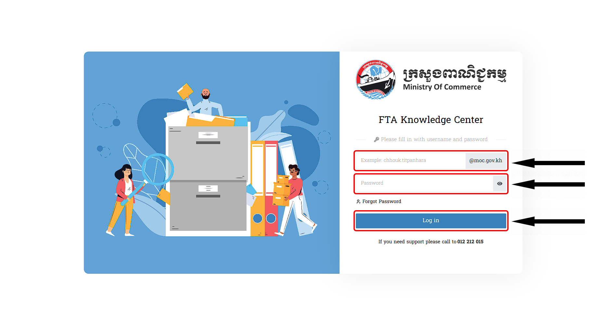

# I. ការចូលប្រើប្រាស់ប្រព័ន្ធ FTA Knowledge Center
- សូមចូលទៅកាន់គេហទំព័រនេះ ដោយចុចលើ Link : <https://youtube.com>
- បន្ទាប់មកវាយ Username និង Password របស់អ្នក
- សូមបន្តចុចលើពាក្យថា `ចូលប្រព័ន្ធ / login​ in` 

::: warning របៀបដោះស្រាយបញ្ហា
ករណីមានបញ្ហាផ្សេងៗក្នុងការប្រើប្រាស់នូវ **ប្រព័ន្ធ FTA Knowledge Center**​ នេះ លោកអ្នកអាចធ្វើការទាក់ទងទៅកាន់លេខទូរស័ព្ទនេះ   `Tel: 012 212 015` ដើម្បីសួរព័ត៌មានបន្ថែម
:::

## 1. ការប្រើប្រាស់ខុស
- សូមធ្វើការវាយ ឈ្មោះរបស់អ្នក/(Username) និង ពាក្យសម្ងាត់/(Password) ឲ្យបានត្រឹមត្រូវដើម្បីចូលប្រព័ន្ធ  

 > បើវាយតែ **(ឈ្មោះ) / Username** ដោយគ្មាន **(ពាក្យសម្ងាត់) / Password** ក្រោយចុចបញ្ជូននឹងមានពាក្យថា `Password must be input!`
  

 > បើវាយតែ **(ពាក្យសម្ងាត់) / Password** ដោយគ្មាន **(ឈ្មោះ) / Username** ក្រោយចុចបញ្ជូននឹងមានពាក្យថា `Username must be input!`

  

::: danger សូមលោកអ្នកធ្វើការវាយឡើងវិញដោយចុចលើពាក្យ​ Try again ដើម្បីទៅកាន់ទីតាំងដើមវិញ 

:::

## 2. ការប្រើប្រាស់ត្រឹមត្រូវ
ការបញ្ចូលនូវ `Username` និង `Password` មានលក្ខណ:ត្រឹមត្រូវវាចាំបាច់អ្នកប្រើប្រាស់ធ្វើតាមការណែរបៀបនេះ នោះវានឹងបង្ហាញព័ត៌មានដូចមានខាងក្រោមនេះ :

> បើវាយត្រឹមត្រូវ នឹងមានពាក្យថា *ជោគជ័យ អ្នកបានចូលប្រព័ន្ធជោគជ័យ សូមស្វាគមន៍មកកាន់ ប្រព័ន្ធមន្ត្រីរាជការក្រសួងពាណិជ្ជកម្ម*

