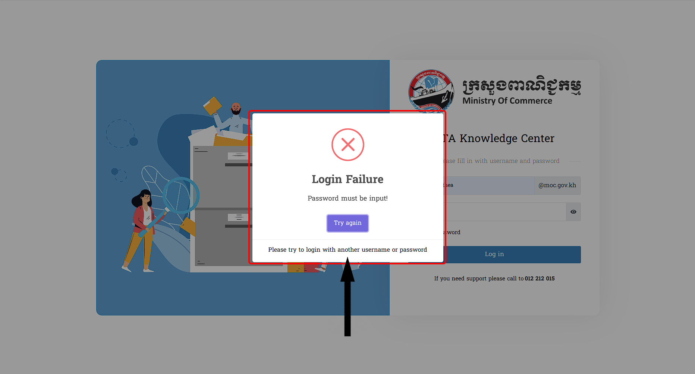
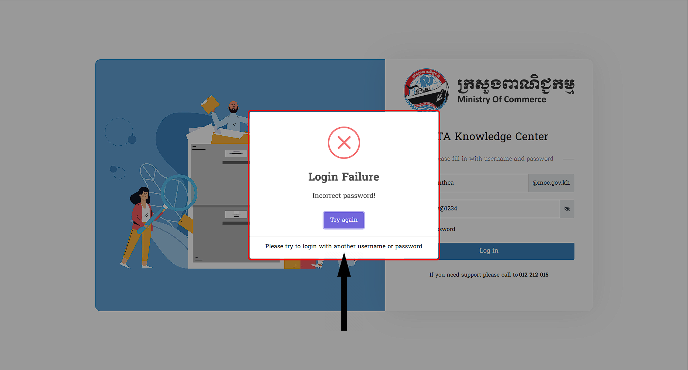
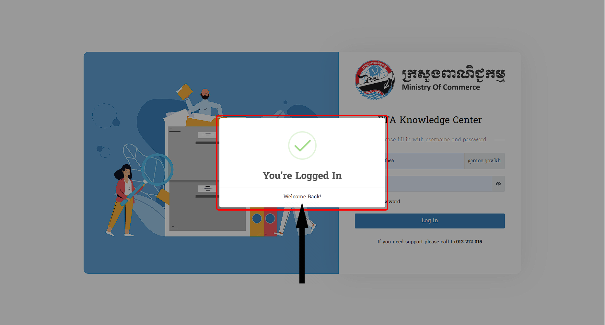

# I. ការចូលប្រើប្រាស់ប្រព័ន្ធ FTA Knowledge Center
- សូមចូលទៅកាន់គេហទំព័រនេះ ដោយចុចលើ Link : <https://youtube.com>
- បន្ទាប់មកវាយ Username និង Password របស់អ្នក
- សូមបន្តចុចលើពាក្យថា `ចូលប្រព័ន្ធ / login​ in` 

::: warning របៀបដោះស្រាយបញ្ហា
ករណីមានបញ្ហាផ្សេងៗក្នុងការប្រើប្រាស់នូវ **ប្រព័ន្ធ FTA Knowledge Center**​ នេះ លោកអ្នកអាចធ្វើការទាក់ទងទៅកាន់លេខទូរស័ព្ទនេះ   `Tel: 012 212 015` ដើម្បីសួរព័ត៌មានបន្ថែម
:::

## 1. ការប្រើប្រាស់ខុស

ចំពោះករណីលោកអ្នកមានកំហុសក្នុងការប្រើប្រាស់រួមមានលក្ខខណ្ឌដូចជា :

::: tip ករណីអ្នកប្រើប្រាស់មិនបានផ្តល់ឈ្មោះអ្នកប្រើប្រាស់ និងពាក្យសម្ងាត់
 > បើវាយដោយគ្មាន **(ឈ្មោះ) / Username** ហើយគ្មាន **(ពាក្យសម្ងាត់) / Password** ក្រោយចុច `Log in` នឹងមានពាក្យថា `Password​ and Username must be input!` ខាងក្រោមពាក្យ *Login Failure*
  

:::

::: tip ករណីអ្នកប្រើប្រាស់មិនបានបញ្ចូលពាក្យសម្ងាត់
 > បើវាយតែ **(ឈ្មោះ) / Username** ដោយគ្មាន **(ពាក្យសម្ងាត់) / Password** ក្រោយចុច `Log in` នឹងមានពាក្យថា `Password must be input!` ខាងក្រោមពាក្យ *Login Failure*
  

:::

::: tip ករណីអ្នកប្រើប្រាស់បញ្ចូលឈ្មោះមិនត្រឹមត្រូវអំឡុងពេលដំណើរការចូលប្រព័ន្ធ

 > បើវាយគ្មាន **(ឈ្មោះ) / Username** ដោយតែមាន **(ពាក្យសម្ងាត់) / Password** ក្រោយចុច `Log in` នឹងមានពាក្យថា `Username must be input!` ខាងក្រោមពាក្យ *Login Failure*

:::

::: tip ករណីបញ្ចូលឈ្មោះអ្នកប្រើប្រាស់មិនត្រឹមត្រូវអំឡុងពេលដំណើរការបញ្ចូល
 > សម្រាប់លោកអ្នកវាយ **(ឈ្មោះ) / Username** ដោយមានការលើសពាក្យឬក៏មិនមានលក្ខណ:ត្រឹមត្រូវតាមភាពពិតនៃ
 ឈ្មោះប្រើប្រាស់នោះវានឹងមានពាក្យថា `Username does not exist!` ក្រោយចុច `Log in` នឹងមានពាក្យថា `Username must be input!` ខាងក្រោមពាក្យ *Login Failure*

:::

::: tip ករណីអ្នកប្រើប្រាស់ដាក់ឈ្មោះ (Website, {ឧទាហរណ៍ : ...@gmail.com} ) បន្ថែមក្នុងកំឡុងពេលដំណើរការបញ្ចូល
 >សម្រាប់លោកអ្នកធ្វើការបញ្ចូលឈ្មោះដោយភ្ជាប់ជាមួយនឹង Domain (ឈ្មោះ Website ) ផ្សេង ក្រោយចុច `Log in` នឹងមានពាក្យថា `Username must be input!` ខាងក្រោមពាក្យ *Login Failure*

 
:::

::: tip ករណីអ្នកប្រើប្រាស់បញ្ចូលពាក្យសម្ងាត់មិនត្រឹមត្រូវអំឡុងពេលដំណើរការបញ្ចូលក្នុងប្រព័ន្ធ
 >សម្រាប់ការបញ្ចូលពាក្យសម្ងាត់មិនមានភាពច្បាស់លាស់ទៅតាមអ្វីដែលមាននោះ ក្រោយពីធ្វ់ើការចុច `Log in` នឹងមានពាក្យថា `Incorrect password!` នៅខាងក្រោមពាក្យ *Login Failure*

 
:::

::: danger សូមលោកអ្នកធ្វើការវាយឡើងវិញដោយចុចលើពាក្យ​ Try again ដើម្បីទៅកាន់ទីតាំងដើមវិញ
:::

## 2. ការប្រើប្រាស់ត្រឹមត្រូវ
ការបញ្ចូលនូវ `Username` និង `Password` មានលក្ខណ:ត្រឹមត្រូវវាចាំបាច់អ្នកប្រើប្រាស់ធ្វើតាមការណែរបៀបនេះ នោះវានឹងបង្ហាញព័ត៌មានដូចមានខាងក្រោមនេះ :
::: tip ការបញ្ចូលទាំងឈ្មោះ និង ពាក្យសម្ងាត់ ត្រឹមត្រូវ
> បើវាយត្រឹមត្រូវ នឹងមានពាក្យថា **ជោគជ័យ អ្នកបានចូលប្រព័ន្ធជោគជ័យ សូមស្វាគមន៍មកកាន់ ប្រព័ន្ធមន្ត្រីរាជការក្រសួងពាណិជ្ជកម្ម**

:::