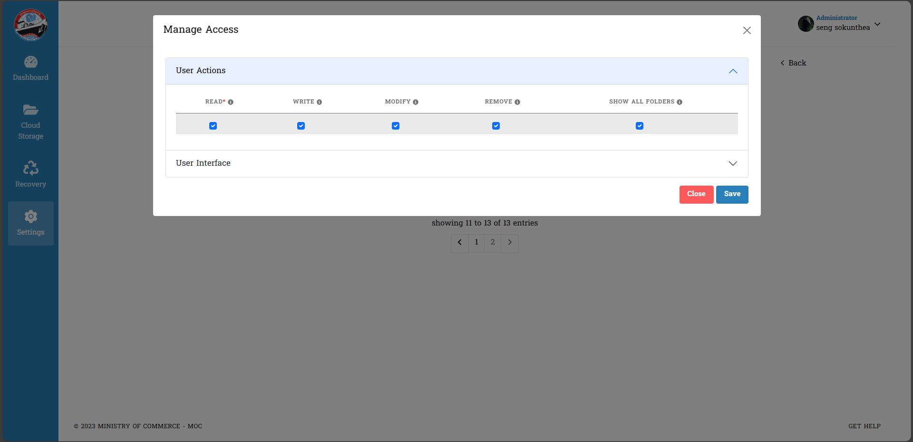

# I. Manage Access

នេះជាគេហទំព័រសម្រាប់ណែនាំដល់ Admin ដែលមានតួនាទីសំខាន់សម្រាប់គ្រប់គ្រងមុខងារដែលស្ថិតក្នុងគេហទំព័រ `Roles`
::: danger ចំណាំ
ដើម្បីដំណើរការដល់ចំណុចនីមួយៗ **Admin** គប្បីធ្វើការ *Assign Role* ដល់ User ក្នុងគេហទំព័រ `Users` លើចំណុច _Action_ ជាមុនសិន

បន្ទាប់ពីចូលក្នុង Action រួច :

:::
## ១. ការយល់ដឹងអំពីព័ត៌មានក្នុង Manage Access នៃ Roles

::: tip វិធីសាស្ត្រយល់ច្បាស់ជាមួយនឹងការប្រើប្រាស់ Manage Access

ការចូលទៅកាន់ Manage Access ព័ត៌មានទាំងអស់នឹងមានបង្ហាញ :
ព័ត៌មានចំនួន ២ គឺ

- User Actions
- User Interface

> _User Actions_ : រាល់ព័ត៌មានទាំងអស់អ្នកប្រើប្រាស់អាចមើលឃើញមុខងាផ្សេងៗ
> បន្ថែមពីនោះចំណុច `READ *` ជាចំណុចដែលអ្នកប្រើប្រាស់មិនអាចកែប្រែបាន
> 
> អ្នកប្រើប្រាស់អាចធ្វើការដក ឬ ដាក់នូវមុខងារទាំងអស់បាន

> _User Interface_ : អ្នកប្រើប្រាស់អាចធ្វើការកំណត់ព័ត៌មានលើចំណុចនីមួយៗ
> 

- ចុច _Save_ ដើម្បីធ្វើការបញ្ជាក់ថាការចង់រក្សាទុក
- ចុច _Cancel_ សម្រាប់ទៅរកទម្រង់ដើម
  :::

## ២. ការមិនបើកចំណុចទាំងអស់ក្នុង User Permissions និង User Interface

::: tip វិធីសាស្ត្រយល់ដឹងអំពីការកំណត់ព័ត៌មានក្នុង User Permissions និង User Interface

- សម្រាប់ Admin មិនបាន Click ✅ ក្នុងចំណុចណាមួយនៃ User Permissions និង User Interface ទេ ។
- ក្រោយចុច _Save_ រួច _User_ ដែលបានបង្កើតដោយ `Admin` នោះ មានតួនាទីជា _default_ _(លំនាំដើម ឬ លំនាំធម្មតា)_

ព័ត៌មានសម្រាប់ Admin :

ព័ត៌មានសម្រាប់ User :

:::

## ៣. ការបើកអនុញ្ញាតសកម្មភាពទាំងអស់ក្នុង User Interface
::: tip វិធីសាស្ត្រយល់ដឹងអំពីការបើកគ្រប់ចំណុចទាំងអស់ក្នុងគេហទំព័រ User Interface
- ចូលទៅកាន់ _User Interface_ ក្នុងចំណុច `Dashbord`
- ផ្តល់ព័ត៌មានគ្រប់ចំណុចដែលមិនទាន់បានបំពេញរួច

ព័ត៌មានសម្រាប់ Admin ត្រូវធ្វើ :

 
`Admin` បានផ្តល់តួនាទីឲ្យ **User** ចូលក្នុងប្រព័ន្ធបានត្រឹមតែចូលមើលតែប៉ុណ្ណោះ!

ព័ត៌មានសម្រាប់ User ត្រូវដឹង :   
Coming soon ....
::: 
## ៤.ការអនុញ្ញាតទាំងអស់នៅក្នុង User Permissions  និង User Interface គ្រប់ចំណុច
::: tip វិធីសាស្ត្រយល់ដឹងអំពីការបើកដំណើរការនូវសកម្មភាពផ្សេងៗក្នុងចំណុចទាំងពីរ
- ចូលទៅកាន់ Manage Access ដដែលបន្ទាប់មកចូលទៅចុចអនុញ្ញាតទាំងពីរចំណុចរួមមាន `User Permissions` និង `User Interface` 
- ក្នុង `User Interface` ចុចអនុញ្ញាតទាំង *Dashboard* , *Cloud Storage* , *Recovery* , *Settings* ផងដែរ ។

ព័ត៌មានសម្រាប់ Admin ត្រូវធ្វើ :

>ការបើកចំណុចទាំងពីរខាងលើគឺអនុញ្ញាតឲ្យ User (អ្នកប្រើប្រាស់) មានសិទ្ធិក្នុងការកែប្រែ (Edit, Modify and Remove) គ្រប់ចំណុចលើ Website បាន

នៅក្នុង **Cloud Storage** អ្នកប្រើប្រាស់អាច :
- ការបង្កើត Batch Upload 
- ការបង្កើត File 
- ការបង្កើត Folder

ក្នុង **Dashboard** អ្នកប្រើប្រាស់អាច :
- អាចចូលមើលនឹងកែប្រែគ្រប់ចំណុចដែលមាន
- គ្រប់ព័ត៌មានរបស់ User (អ្នកប្រើប្រាស់) អាចដឹងបាន

ក្នុង **Recovery** អ្នកប្រើប្រាស់អាច : 
- ធ្វើការ «Recovery» (ការយកមកប្រើប្រាស់ជាថ្មី) និង «Delete» ចំពោះ Folder ជាមួយនឹង ទិន្នន័យផ្សេងៗ​ដែលអ្នកប្រើប្រាស់យល់ថាមានបញ្ហា ឬុ ចង់លុបចេញ

ក្នុង **Settings** អ្នកប្រើប្រាស់អាចធ្វើការជាធម្មតា !! 
:::
## ៥. ការអនុញ្ញាតត្រឹមតែចំណុច
