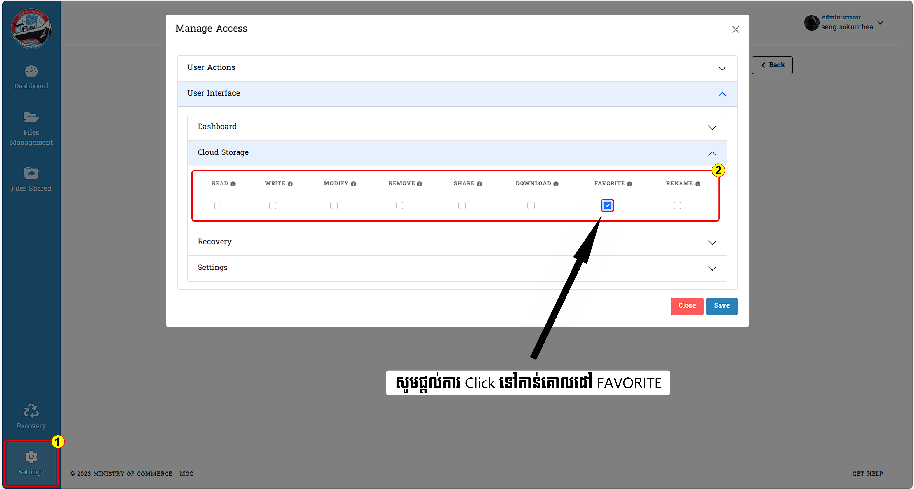

# I. Manage Access

នេះជាគេហទំព័រសម្រាប់ណែនាំដល់ Admin ដែលមានតួនាទីសំខាន់សម្រាប់គ្រប់គ្រងមុខងារដែលស្ថិតក្នុងគេហទំព័រ `Roles`
::: danger ចំណាំ
ដើម្បីដំណើរការដល់ចំណុចនីមួយៗ **Admin** គប្បីធ្វើការ _Assign Role_ ដល់ User ក្នុងគេហទំព័រ `Users` លើចំណុច _Action_ ជាមុនសិន

បន្ទាប់ពីចូលក្នុង Action រួច :

Admin មានសិទ្ធិក្នុងការកំណត់ឲ្យ User ម្នាក់ណាមានសិទ្ធិជាអ្វីបាន
:::

## ១. ការយល់ដឹងអំពីព័ត៌មានក្នុង Manage Access នៃ Roles

::: tip វិធីសាស្ត្រយល់ច្បាស់ជាមួយនឹងការប្រើប្រាស់ Manage Access
Manage Access មានពីរចំណុចយ៉ាងសំខាន់សម្រាប់ផ្តល់តួរនាទីផ្សេងៗទៅកាន់ Users នីមួយៗ:

ការចូលទៅកាន់ Manage Access ព័ត៌មានទាំងអស់នឹងមានបង្ហាញ :

- User Actions
- User Interface

> _User Actions_ : Admin តែម្នាក់គត់មានសិទ្ធិកំណត់ព័ត៌មានដល់អ្នកប្រើប្រាស់ មុននឹងអាចធ្វើការលើ Broswer បាន
> បន្ថែមពីនោះចំណុច `READ *` ជាចំណុចដែល​ Admin មិនអាចកែប្រែបាន    > 
> Admin អាចធ្វើការដក ឬ ដាក់នូវមុខងារទាំងអស់បាន

> _User Interface_ : សម្រាប់បង្ហាញព័ត៌មានសំខាន់ដល់ Users ប្រើប្រាស់ ។ សម្រាប់ Admin គឺមានតួនាទីមួយនេះ    > 

- ចុច _Save_ ដើម្បីធ្វើការបញ្ជាក់ថាការចង់រក្សាទុក
- ចុច _Cancel_ សម្រាប់ទៅរកទម្រង់ដើម
  :::

## ២. ការមិនបើកចំណុចទាំងអស់ក្នុង User Permissions និង User Interface

::: tip វិធីសាស្ត្រយល់ដឹងអំពីការកំណត់ព័ត៌មានក្នុង User Permissions និង User Interface

- សម្រាប់ Admin មិនបាន Click ✅ ក្នុងចំណុចណាមួយនៃ User Permissions និង User Interface ទេ ។
- ក្រោយចុច _Save_ រួច _User_ ដែលបានបង្កើតដោយ `Admin` នោះ មានតួនាទីជា _default_ _(លំនាំដើម ឬ លំនាំធម្មតា)_

ព័ត៌មានសម្រាប់ Admin :

ព័ត៌មានសម្រាប់ User :

:::

## ៣. ការបើកអនុញ្ញាតសកម្មភាពទាំងអស់ក្នុង User Interface

::: tip វិធីសាស្ត្រយល់ដឹងអំពីការបើកគ្រប់ចំណុចទាំងអស់ក្នុងគេហទំព័រ User Interface

- ចូលទៅកាន់ _User Interface_ ក្នុងចំណុច `Dashbord`
- ផ្តល់ព័ត៌មានគ្រប់ចំណុចដែលមិនទាន់បានបំពេញរួច

ព័ត៌មានសម្រាប់ Admin ត្រូវធ្វើ :

`Admin` បានផ្តល់តួនាទីឲ្យ **User** ចូលក្នុងប្រព័ន្ធបានត្រឹមតែចូលមើលតែប៉ុណ្ណោះ!

ព័ត៌មានសម្រាប់ User ត្រូវដឹង :  
Coming soon ....
:::

## ៤.ការអនុញ្ញាតទាំងអស់នៅក្នុង User Permissions និង User Interface គ្រប់ចំណុច

::: tip វិធីសាស្ត្រយល់ដឹងអំពីការបើកដំណើរការនូវសកម្មភាពផ្សេងៗក្នុងចំណុចទាំងពីរធំៗ

- ចូលទៅកាន់ Manage Access ដដែលបន្ទាប់មកចូលទៅចុចអនុញ្ញាតទាំងពីរចំណុចធំៗរួមមាន `User Permissions` និង `User Interface`
- ក្នុង `User Interface` ចុចអនុញ្ញាតទាំង _Dashboard_ , _Cloud Storage_ , _Recovery_ , _Settings_ ផងដែរ ។

ព័ត៌មានសម្រាប់ Admin ត្រូវធ្វើ :

> ការបើកចំណុចទាំងពីរខាងលើគឺអនុញ្ញាតឲ្យ User (អ្នកប្រើប្រាស់) មានសិទ្ធិក្នុងការកែប្រែ (Edit, Modify and Remove) គ្រប់ចំណុចលើ Website បាន

ក្នុង **Dashboard** អ្នកប្រើប្រាស់អាច :

- អាចចូលមើលនឹងកែប្រែគ្រប់ចំណុចដែលមាន
- គ្រប់ព័ត៌មានរបស់ User (អ្នកប្រើប្រាស់) អាចដឹងបាន

នៅក្នុង **Cloud Storage** អ្នកប្រើប្រាស់អាច :

- បង្កើត Batch Upload
- បង្កើត File
- បង្កើត Folder

ក្នុង **Recovery** អ្នកប្រើប្រាស់អាច :

- ធ្វើការ «Recovery» (ការយកមកប្រើប្រាស់ជាថ្មី) និង «Delete» ចំពោះ Folder ជាមួយនឹង ទិន្នន័យផ្សេងៗ​ដែលអ្នកប្រើប្រាស់យល់ថាមានបញ្ហា ឬុ ចង់លុបចេញ

ក្នុង **Settings** អ្នកប្រើប្រាស់អាចធ្វើការជាធម្មតា !!
:::

## ៥. ការអនុញ្ញាតត្រឹមតែការចូលមើល តែមិនអាចធ្វើការកំណត់បាន

::: tip វិធីសាស្ត្រយល់ដឹងអំពីការកំណត់មិនឲ្យធ្វើអ្វីបានក្រៅពីការអាន
ព័ត៌មានសម្រាប់ Admin ត្រូវធ្វើ :

> បើ Admin មានគំនិតចង់ឲ្យ User ធ្វើការងារត្រឹមតែ អាន មួយលក្ខខណ្ឌនោះ នេះជាកាតាបកិច្ចដែលត្រូវបំពេញតាម :

- ចំពោះ `User Permission` មិនតម្រូវឲ្យបិទនោះទេ ❌
- តម្រូវឲ្យបិទសញ្ញា Click ✅ ក្នុង `User Interface` គ្រប់ចំណុច
- អ្នកប្រើប្រាស់ ពុំអាចធ្វើការបានទេក្រោយ Admin បានកំណត់រួចរាល់

.png>)

ព័ត៌មានសម្រាប់ User (អ្នកប្រើប្រាស់) ត្រូវដឹង :

- ពុំអាចមើលឃើញ ការបង្ហាញព័ត៌មាននៅផ្នែកខាងឆ្វេងមួយចំនួន (Sidebar)
- មើលបានតែព័ត៌មាន _Settings_ មួយតែប៉ុណ្ណោះ   ក្នុងនោះទទួលបាន _( Account_ និង _change Password)_
- អាចធ្វើការបានត្រឹមតែ `Change Password (ប្តូរពាក្យសម្ងាត់)` និង `Account(បង្កើតព័ត៌មានផ្ទាល់ខ្លួន)` តែប៉ុណ្ណោះ ។
- ការផ្លាស់ប្តូរពាក្យសម្ងាត់រួចនឹងលោតទៅកាន់គេហទំព័រដើមវិញ

:::

## ៦. ការផ្តល់ឲ្យមានការអានគ្រប់ព័ត៌មានតែមិនអាចផ្លាស់ប្តូរចំណុចណាបាន

::: tip វិធីសាស្ត្រយល់ដឹងអំពីការបង្ហាញចេញក្រោយពេលមានការកែប្រែនិងធ្វើតាមការណែនាំតាមដំណាក់កាលនីមួយៗ
ព័ត៌មានសម្រាប់ Admin ត្រូវធ្វើ :

:::

## ៧. ការបិទបញ្ចប់តួនាទីទៅជាទម្រង់លំនាំដើមវិញ

::: tip វិធីសាស្ត្រយល់ដឹងអំពីដំណើរដើម្បីផ្តល់តួនាទីឲ្យក្លាយជាទម្រង់ដើមជាថ្មី ក្នុងបំណងធ្វើការផ្អាកដំណើរការ​និងតួនាទីណាមួយរបស់ users

ព័ត៌មានសម្រាប់ Admin ត្រូវធ្វើ :  
Admin បានមកដល់ក្នុង Manage Access :

- ធ្វើការ click ✅ ក្នុងប្រអប់ទាំង ៤ នេះ
- មិនតម្រូវឲ្យធ្វើការ​ សញ្ញា Click ក្នុង `User Interface` គ្រប់ចំណុច ❌
- ចុច _Save_ ដើម្បីសម្រេចថាអ្នកបានយល់ព្រមក្នុងការកំណត់ធ្វើបែបនោះ

ព័ត៌មានសម្រាប់ User (អ្នកប្រើប្រាស់) ត្រូវដឹង :

- ខាងលើផ្នែកខាងស្តាំបានផ្លាស់ប្តូរឈ្មោះអ្នកប្រើប្រាស់ដែលបានកំណត់ទៅជា _Default_
- ការប្រើប្រាស់បានក្លាយទៅជាទម្រង់នៃរូបភាពដើមវិញទាំងស្រុង
- ធ្វើការបានតែលើ Info (ព័ត៌មាន) _Account_ &nbsp;និង _Change Password_ តែប៉ុណ្ណោះ

:::

## ៨. ការអនុញ្ញាតត្រឹមការអាន និង ការសរសេរដល់អ្នកប្រើប្រាស់

::: tip វិធីសាស្ត្រយល់ដឹងអំពីដំណើរការរបស់ Admin ធ្វើឲ្យ Users មានតួនាទីត្រឹមការ អាន និង ការសរសេរ 
ព័ត៌មានសម្រាប់ Admin ត្រូវធ្វើ :  

- ធ្វើការ Click ✅ ក្នុងប្រអប់ទាំងអស់ដែលមានក្នុង `User Actions`
- បន្ទាប់ពីនោះសូមចូលទៅក្នុង `User Interface` ក្នុង _Dashboard_ ធ្វើការ Click ✅ _READ_ និង _WRITE_
- សម្រាប់ព័ត៌មានក្នុង *Cloud Storage* ធ្វើការ Click ✅ *FAVORITE* តែមួយគត់
- មិនតម្រូវឲ្យធ្វើការ​ Click ព័ត៌មាន ❌​ នៅផ្នែកណាបន្ថែមទៀតទេ

ព័ត៌មានសម្រាប់ User (អ្នកប្រើប្រាស់) ត្រូវដឹង :

- អាចមើលឃើញផ្ទាំង Sidebar ដូចជា : `Dashboard` និង `Setting`
- អាចមើលឃើញផ្ទាំងពីរនៅក្នុង Dashboard (ទំព័រផ្ទាំងគ្រប់គ្រង) `(storage Overview)` និង `(Favorite folders)`
- ទិដ្ឋភាពទូទៅនៃការបង្ហាញចេញ `Storage Overview` អាចមើលឃើញឯកសារ និងទិន្នន័យមួយចំនួន *(រូបភាព , វីដេអូ , ឯកសារ និង ឯកសារផ្សេងទៀត)*
- នៅក្នុង `Storage Overview` អាចឃើញថតឯកសារ និងសកម្មភាពនៃ *(Download , share និង Remove)* ប៉ុន្តែសកម្មភាពទាំងអស់   ❌ មិនដំណើរការទេនៅពេលចុច ❌
- អាចមើលការ Setting និង Tab (កំណត់ទំព័រ និងផ្ទាំង) (Account , Change Password និង Activity logs)
- អាចផ្លាស់ប្តូរ Password (លេខសម្ងាត់) ហើយនៅពេលដែលការផ្លាស់ប្តូរដោយជោគជ័យ ប្តូរទិសទៅកាន់ទំព័រចូល ឬ គេហទំព័រដើមដំបូងវិញ
:::