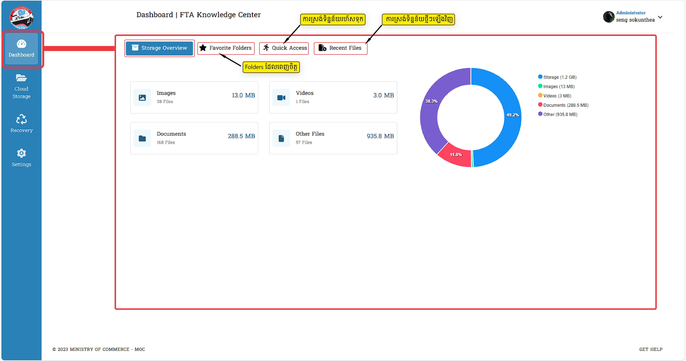
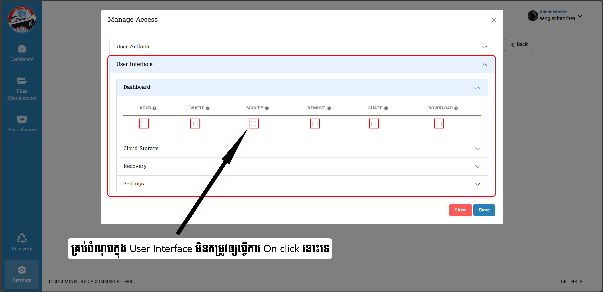
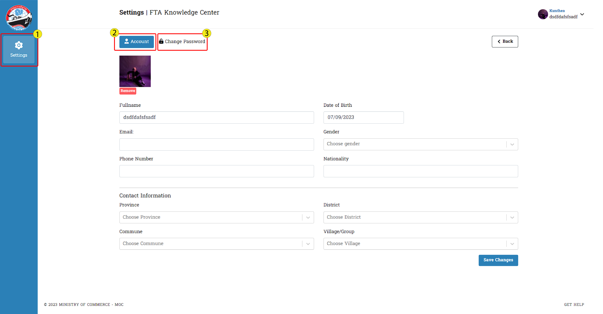
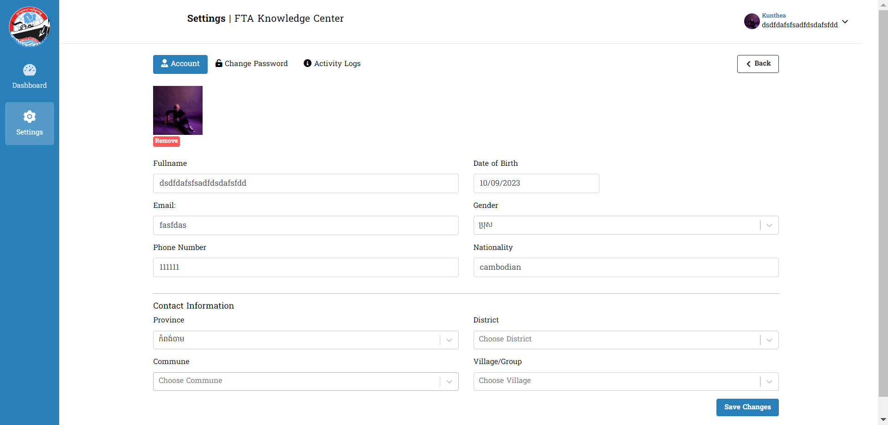
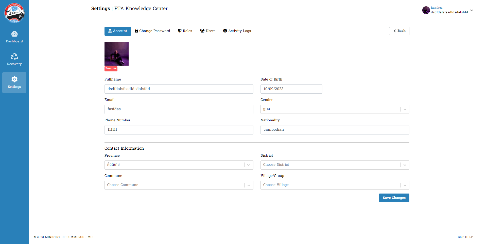
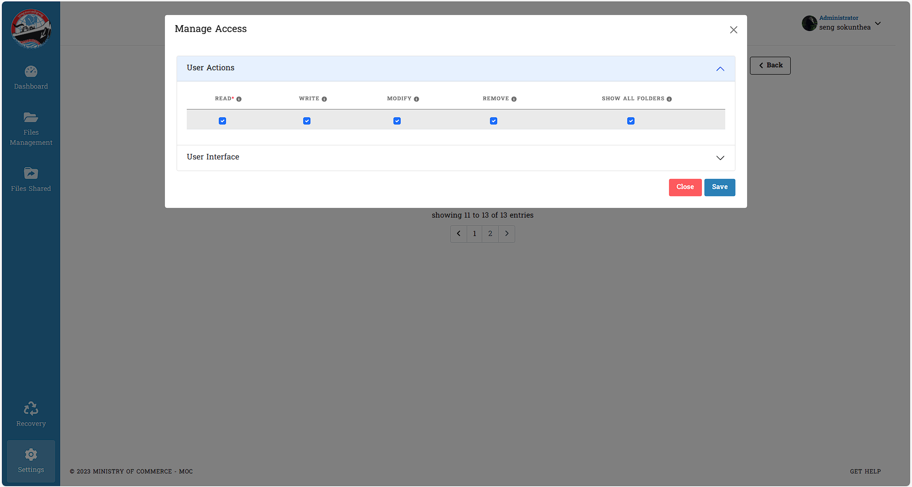

# I. Manage Access

នេះជាគេហទំព័រសម្រាប់ណែនាំដល់ Admin ដែលមានតួនាទីសំខាន់សម្រាប់គ្រប់គ្រងមុខងារដែលស្ថិតក្នុងគេហទំព័រ `Roles`
::: danger ចំណាំ
ដើម្បីដំណើរការដល់ចំណុចនីមួយៗ **Admin** គប្បីធ្វើការ _Assign Role_ ដល់ User ក្នុងគេហទំព័រ `Users` លើចំណុច _Action_ ជាមុនសិន

បន្ទាប់ពីចូលក្នុង Action រួច :

Admin មានសិទ្ធិក្នុងការកំណត់ឲ្យ User ម្នាក់ណាមានសិទ្ធិជាអ្វីបាន
:::

## ១. ការយល់ដឹងអំពីព័ត៌មានក្នុង Manage Access នៃ Roles

::: tip វិធីសាស្ត្រយល់ច្បាស់ជាមួយនឹងការប្រើប្រាស់ Manage Access
Manage Access មានពីរចំណុចយ៉ាងសំខាន់សម្រាប់ផ្តល់តួរនាទីផ្សេងៗទៅកាន់ Users នីមួយៗ:

ការចូលទៅកាន់ Manage Access ព័ត៌មានទាំងអស់នឹងមានបង្ហាញ :

- User Actions
- User Interface

> _User Actions_ : Admin តែម្នាក់គត់មានសិទ្ធិកំណត់ព័ត៌មានដល់អ្នកប្រើប្រាស់ មុននឹងអាចធ្វើការលើ Broswer បាន
> បន្ថែមពីនោះចំណុច `READ *` ជាចំណុចដែល​ Admin មិនអាចកែប្រែបាន    > 
> Admin អាចធ្វើការដក ឬ ដាក់នូវមុខងារទាំងអស់បាន

> _User Interface_ : សម្រាប់បង្ហាញព័ត៌មានសំខាន់ដល់ Users ប្រើប្រាស់ ។ សម្រាប់ Admin គឺមានតួនាទីមួយនេះ    > 

- ចុច _Save_ ដើម្បីធ្វើការបញ្ជាក់ថាការចង់រក្សាទុក
- ចុច _Cancel_ សម្រាប់ទៅរកទម្រង់ដើម
  :::

## ២. ការមិនបើកចំណុចទាំងអស់ក្នុង User Permissions និង User Interface

::: tip វិធីសាស្ត្រយល់ដឹងអំពីការកំណត់ព័ត៌មានក្នុង User Permissions និង User Interface

- សម្រាប់ Admin មិនបាន Click ✅ ក្នុងចំណុចណាមួយនៃ User Permissions និង User Interface ទេ ។
- ក្រោយចុច _Save_ រួច _User_ ដែលបានបង្កើតដោយ `Admin` នោះ មានតួនាទីជា _default_ _(លំនាំដើម ឬ លំនាំធម្មតា)_

ព័ត៌មានសម្រាប់ Admin :

ព័ត៌មានសម្រាប់ User :

:::

## ៣. ការបើកអនុញ្ញាតសកម្មភាពទាំងអស់ក្នុង User Interface

::: tip វិធីសាស្ត្រយល់ដឹងអំពីការបើកគ្រប់ចំណុចទាំងអស់ក្នុងគេហទំព័រ User Interface

- ចូលទៅកាន់ _User Interface_ ក្នុងចំណុច `Dashbord`
- ផ្តល់ព័ត៌មានគ្រប់ចំណុចដែលមិនទាន់បានបំពេញរួច

ព័ត៌មានសម្រាប់ Admin ត្រូវធ្វើ :

`Admin` បានផ្តល់តួនាទីឲ្យ **User** ចូលក្នុងប្រព័ន្ធបានត្រឹមតែចូលមើលតែប៉ុណ្ណោះ!

ព័ត៌មានសម្រាប់ User ត្រូវដឹង :  
Coming soon ....
:::

## ៤.ការអនុញ្ញាតទាំងអស់នៅក្នុង User Permissions និង User Interface គ្រប់ចំណុច

::: tip វិធីសាស្ត្រយល់ដឹងអំពីការបើកដំណើរការនូវសកម្មភាពផ្សេងៗក្នុងចំណុចទាំងពីរធំៗ

- ចូលទៅកាន់ Manage Access ដដែលបន្ទាប់មកចូលទៅចុចអនុញ្ញាតទាំងពីរចំណុចធំៗរួមមាន `User Permissions` និង `User Interface`
- ក្នុង `User Interface` ចុចអនុញ្ញាតទាំង _Dashboard_ , _Cloud Storage_ , _Recovery_ , _Settings_ ផងដែរ ។

ព័ត៌មានសម្រាប់ Admin ត្រូវធ្វើ :

> ការបើកចំណុចទាំងពីរខាងលើគឺអនុញ្ញាតឲ្យ User (អ្នកប្រើប្រាស់) មានសិទ្ធិក្នុងការកែប្រែ (Edit, Modify and Remove) គ្រប់ចំណុចលើ Website បាន

ក្នុង **Dashboard** អ្នកប្រើប្រាស់អាច :

- អាចចូលមើលនឹងកែប្រែគ្រប់ចំណុចដែលមាន
- គ្រប់ព័ត៌មានរបស់ User (អ្នកប្រើប្រាស់) អាចដឹងបាន

នៅក្នុង **Cloud Storage** អ្នកប្រើប្រាស់អាច :

- បង្កើត Batch Upload
- បង្កើត File
- បង្កើត Folder

ក្នុង **Recovery** អ្នកប្រើប្រាស់អាច :

- ធ្វើការ «Recovery» (ការយកមកប្រើប្រាស់ជាថ្មី) និង «Delete» ចំពោះ Folder ជាមួយនឹង ទិន្នន័យផ្សេងៗ​ដែលអ្នកប្រើប្រាស់យល់ថាមានបញ្ហា ឬុ ចង់លុបចេញ

ក្នុង **Settings** អ្នកប្រើប្រាស់អាចធ្វើការជាធម្មតា !!
:::

## ៥. ការអនុញ្ញាតត្រឹមតែការចូលមើល តែមិនអាចធ្វើការកំណត់បាន

::: tip វិធីសាស្ត្រយល់ដឹងអំពីការកំណត់មិនឲ្យធ្វើអ្វីបានក្រៅពីការអាន
ព័ត៌មានសម្រាប់ Admin ត្រូវធ្វើ :

> បើ Admin មានគំនិតចង់ឲ្យ User ធ្វើការងារត្រឹមតែ អាន មួយលក្ខខណ្ឌនោះ នេះជាកាតាបកិច្ចដែលត្រូវបំពេញតាម :

- ចំពោះ `User Permission` មិនតម្រូវឲ្យបិទនោះទេ ❌
- តម្រូវឲ្យបិទសញ្ញា Click ✅ ក្នុង `User Interface` គ្រប់ចំណុច
- អ្នកប្រើប្រាស់ ពុំអាចធ្វើការបានទេក្រោយ Admin បានកំណត់រួចរាល់

.png>)

ព័ត៌មានសម្រាប់ User (អ្នកប្រើប្រាស់) ត្រូវដឹង :

- ពុំអាចមើលឃើញ ការបង្ហាញព័ត៌មាននៅផ្នែកខាងឆ្វេងមួយចំនួន (Sidebar)
- មើលបានតែព័ត៌មាន _Settings_ មួយតែប៉ុណ្ណោះ   ក្នុងនោះទទួលបាន _( Account_ និង _change Password)_
- អាចធ្វើការបានត្រឹមតែ `Change Password (ប្តូរពាក្យសម្ងាត់)` និង `Account(បង្កើតព័ត៌មានផ្ទាល់ខ្លួន)` តែប៉ុណ្ណោះ ។
- ការផ្លាស់ប្តូរពាក្យសម្ងាត់រួចនឹងលោតទៅកាន់គេហទំព័រដើមវិញ

:::

## ៦. ការផ្តល់ឲ្យមានការអានគ្រប់ព័ត៌មានតែមិនអាចផ្លាស់ប្តូរចំណុចណាបាន

::: tip វិធីសាស្ត្រយល់ដឹងអំពីការបង្ហាញចេញក្រោយពេលមានការកែប្រែនិងធ្វើតាមការណែនាំតាមដំណាក់កាលនីមួយៗ
ព័ត៌មានសម្រាប់ Admin ត្រូវធ្វើ :

:::

## ៧. ការបិទបញ្ចប់តួនាទីទៅជាទម្រង់លំនាំដើមវិញ

::: tip វិធីសាស្ត្រយល់ដឹងអំពីដំណើរដើម្បីផ្តល់តួនាទីឲ្យក្លាយជាទម្រង់ដើមជាថ្មី ក្នុងបំណងធ្វើការផ្អាកដំណើរការ​និងតួនាទីណាមួយរបស់ users

ព័ត៌មានសម្រាប់ Admin ត្រូវធ្វើ :  
Admin បានមកដល់ក្នុង Manage Access :

- ធ្វើការ click ✅ ក្នុងប្រអប់ទាំង ៤ នេះ
- មិនតម្រូវឲ្យធ្វើការ​ សញ្ញា Click ក្នុង `User Interface` គ្រប់ចំណុច ❌
- ចុច _Save_ ដើម្បីសម្រេចថាអ្នកបានយល់ព្រមក្នុងការកំណត់ធ្វើបែបនោះ

ព័ត៌មានសម្រាប់ User (អ្នកប្រើប្រាស់) ត្រូវដឹង :

- ខាងលើផ្នែកខាងស្តាំបានផ្លាស់ប្តូរឈ្មោះអ្នកប្រើប្រាស់ដែលបានកំណត់ទៅជា _Default_
- ការប្រើប្រាស់បានក្លាយទៅជាទម្រង់នៃរូបភាពដើមវិញទាំងស្រុង
- ធ្វើការបានតែលើ Info (ព័ត៌មាន) *Account*និង _Change Password_ តែប៉ុណ្ណោះ

:::

## ៨. ការអនុញ្ញាតត្រឹមការអាន និង ការសរសេរដល់អ្នកប្រើប្រាស់

::: tip វិធីសាស្ត្រយល់ដឹងអំពីដំណើរការរបស់ Admin ធ្វើឲ្យ Users មានតួនាទីត្រឹមការ អាន និង ការសរសេរ
ព័ត៌មានសម្រាប់ Admin ត្រូវធ្វើ :  

- ធ្វើការ Click ✅ ក្នុងប្រអប់ទាំងអស់ដែលមានក្នុង `User Actions`
- បន្ទាប់ពីនោះសូមចូលទៅក្នុង `User Interface` ក្នុង _Dashboard_ ធ្វើការ Click ✅ _READ_ និង _WRITE_
- សម្រាប់ព័ត៌មានក្នុង _Cloud Storage_ ធ្វើការ Click ✅ _FAVORITE_ តែមួយគត់
- មិនតម្រូវឲ្យធ្វើការ​ Click ព័ត៌មាន ❌​ នៅផ្នែកណាបន្ថែមទៀតទេ

ព័ត៌មានសម្រាប់ User (អ្នកប្រើប្រាស់) ត្រូវដឹង :

- អាចមើលទំព័រ Dashboard ( Dashboard | FTA Knowledge Center )
- អាចមើលឃើញផ្ទាំងបួននៅក្នុង Dashboard (ទំព័រផ្ទាំងគ្រប់គ្រង)   🧮 _Storage Overview_ , 📂 _Favorite Folders_ , 🔗 _Quick Access_  
  និង 📚*Recent Files*
- ទិដ្ឋភាពទូទៅនៃការបង្ហាញចេញ _Storage Overview_ អាចមើលឃើញឯកសារ និងទិន្នន័យមួយចំនួន _(👨 រូបភាព ,🎥 វីដេអូ ,📝 ឯកសារ និង 📰 ឯកសារផ្សេងទៀត)_
- នៅក្នុង _Storage Overview_ អាចឃើញថតឯកសារ និងសកម្មភាពនៃ _(Download , share និង Remove)_ ប៉ុន្តែសកម្មភាពទាំងអស់ ❌ មិនដំណើរការទេនៅពេលចុចចំណុចណាមួយនោះ ❌
- អាចមើលពី `Setting` និង `Tab` (កំណត់ទំព័រ និងផ្ទាំង)​ ដែលក្នុងនោះមានដូចជា _(Account , Change Password_ និង _Activity logs)_
- អាចផ្លាស់ប្តូរ _Password_ (លេខសម្ងាត់) ហើយនៅពេលដែលការផ្លាស់ប្តូរដោយជោគជ័យលោកអ្នកនឹង ប្តូរទិសទៅកាន់ទំព័រចូល ឬ គេហទំព័រដើមដំបូងវិញ

ចំពោះព័ត៌មាននៅលើ **Sidebar** :

ចំពោះព័ត៌មាននៅក្នុង **Dashboard** ចំណុច 🧮 _« Storage Overview »_

> ក្នុង Storage Overview បានត្រឹមការមើលឃើញតែប៉ុណ្ណោះ

ចំពោះព័ត៌មាននៅក្នុង **Dashboard** ចំណុច _« Favorite Folders »_

ចំពោះព័ត៌មាននៅក្នុង **Dashboard** ចំណុច _« Quick Access »_

ចំពោះព័ត៌មាននៅក្នុង **Dashboard** ចំណុច _« Recent Files »_

ចំពោះព័ត៌មាននៅក្នុង **Setting** ⚙️ :

:::

## ៩. ការកំណត់ក្នុង User Interface ត្រង់គេហទំព័រ Dashboard និង Cloud Storage

::: tip វិធីសាស្ត្រយល់ដឹងពីការបើកគ្រប់ចំណុចក្នុងគេហទំព័រ Dashboard និងបើក Favorite Folders តែមួយគត់ក្នុងគេហទំព័រ Cloud Storage
ព័ត៌មានសម្រាប់ Admin ត្រូវធ្វើ :

- ផ្តល់ការ Click ✅ ក្នុង _User Actions_ គ្រប់ចំណុច
- ក្នុងគេហទំព័រ _Dashboard_ ក៏ត្រូវធ្វើការបំពេញ Click ✅ គ្រប់ចំណុចដូចគ្នា
- ស្ថិតក្នុងគេហទំព័័រ _Cloud Storage_ ដោយធ្វើការ Click ✅ ត្រឹមតែ _FAVORITE_ មួយគត់
- ក្នុង `Settings` ធ្វើការ Click ✅ ចំណុច _READ_

ព័ត៌មានសម្រាប់ User (អ្នកប្រើប្រាស់) ត្រូវដឹង :

- អាចមើលទំព័រ Dashboard ( Dashboard | FTA Knowledge Center )
- អាចមើលឃើញផ្ទាំងចំនួន ៤ នៅក្នុងគេហទំព័រ `Dashboard` (ផ្ទាំងគ្រប់គ្រង) ( _🧮 Storage Overview_ , 📂 *Favorite Folders* , 🔗 *Quick Access* ,
  📚 *Recent Files*)
=======
- អាចមើលឃើញទំព័រ `Dashboard` និង `Settings` ( _Dashboard | FTA Knowledge Center_ )
- អាចមើលឃើញផ្ទាំងចំនួន ៤ នៅក្នុងគេហទំព័រ `Dashboard` (ផ្ទាំងគ្រប់គ្រង) ( _🧮 Storage Overview_ , 📂 _Favorite Folders_ , 🔗 _Quick Access_ ,
  📚 _Recent Files_)

- ទិដ្ឋភាពទូទៅនៃការបង្ហាញចេញ _Storage Overview_ អាចមើលឃើញឯកសារ និងទិន្នន័យមួយចំនួន _(👨 រូបភាព ,🎥 វីដេអូ ,📝 ឯកសារ និង 📰 ឯកសារផ្សេងទៀត)_
- អាចឃើញ `Setting` និង `Tab` (កំណត់ទំព័រ និងផ្ទាំង)​ ដែលក្នុងនោះមានដូចជា _(Account , Change Password_ និង _Activity logs)_

ចំពោះព័ត៌មាននៅក្នុង **Dashboard** :

ចំពោះព័ត៌មាននៅក្នុង **Dashboard** ចំណុច 🧮 **Storage Overview** :

ចំពោះព័ត៌មាននៅក្នុង **Setting** ⚙️ :

:::

## ១០. ការកំណត់ក្នុង User Interface ត្រង់គេហទំព័រ Dashboard និង Cloud Storage

::: tip វិធីសាស្ត្រយល់ដឹងពីការបើកត្រឹមតែ READ និង WRITE (ការអាន និង ការសរសេរ) ក្នុងគេហទំព័រ Dashboard រួមជាមួយនឹងបើក Favorite Folders តែមួយគត់ក្នុងគេហទំព័រ Cloud Storage និង បើក Read ក្នុង Activity Logs

ព័ត៌មានសម្រាប់ Admin ត្រូវធ្វើ :

- ផ្តល់ការ Click ✅ ក្នុង *User Actions* គ្រប់ចំណុច
- ក្នុងគេហទំព័រ *Dashboard* ត្រូវធ្វើការបំពេញ Click ✅ នៅចំណុច *READ* និង *WRITE*
- ស្ថិតក្នុងគេហទំព័័រ *Cloud Storage* ដោយធ្វើការ Click ✅ ត្រឹមតែ *FAVORITE* មួយគត់
- ក្នុង *Settings* ធ្វើការ Click ✅ ចំណុច *READ*
=======

- ផ្តល់ការ Click ✅ ក្នុង _User Actions_ គ្រប់ចំណុច
- ក្នុងគេហទំព័រ _Dashboard_ ក៏ត្រូវធ្វើការបំពេញ Click ✅ នៅចំណុច _READ_ និង _WRITE_
- ស្ថិតក្នុងគេហទំព័័រ _Cloud Storage_ ដោយធ្វើការ Click ✅ ត្រឹមតែ _FAVORITE_ មួយគត់
- ក្នុង _Settings_ ត្រង់ _Activity Logs_ ធ្វើការ Click ✅ ចំណុច _READ_

=======
ព័ត៌មានសម្រាប់ User (អ្នកប្រើប្រាស់) ត្រូវដឹង :

- អាចមើលឃើញទំព័រ `Dashboard` និង `Settings` ( _Dashboard | FTA Knowledge Center_ )
- អាចមើលឃើញផ្ទាំងចំនួន ៤ នៅក្នុងគេហទំព័រ `Dashboard` (ផ្ទាំងគ្រប់គ្រង) ( _🧮 Storage Overview_ , 📂 _Favorite Folders_ , 🔗 _Quick Access_ ,
  📚 _Recent Files_)
- ទិដ្ឋភាពទូទៅនៃការបង្ហាញចេញ _Storage Overview_ អាចមើលឃើញឯកសារ និងទិន្នន័យមួយចំនួន _(👨 រូបភាព ,🎥 វីដេអូ ,📝 ឯកសារ និង 📰 ឯកសារផ្សេងទៀត)_
- អាចឃើញ `Setting` និង `Tab` (កំណត់ទំព័រ និងផ្ទាំង)​ ដែលក្នុងនោះមានដូចជា _(Account , Change Password_ និង _Activity logs)_
- អាចមើលកម្រងព័ត៌មាន និងកែសម្រួលព័ត៌មាន (Profile & Edit Info)
  > នៅពេលដែលការផ្លាស់ប្តូរពាក្យសម្ងាត់ដោយជោគជ័យ នឹងធ្វើការប្តូរទិសទៅកាន់ទំព័រដើមវិញ

ចំពោះព័ត៌មាននៅក្នុង **Dashboard** :

ចំពោះព័ត៌មាននៅក្នុង **Dashboard** ចំណុច 🧮 **Storage Overview** :

ចំពោះព័ត៌មាននៅក្នុង **Setting** ⚙️ :

ចំពោះព័ត៌មាននៅក្នុង **Setting** ⚙️ ក្រោយពីផ្លាស់ប្តូរពាក្យសំងាត់រួចរាល់ :

:::

## ១១. ការកំណត់ក្នុង User Interface ត្រង់គេហទំព័រ Cloud Storage

:::tip វិធីសាស្ត្រយល់ដឹងពីការបើកគ្រប់ចំណុចទាំងអស់ក្នុងគេហទំព័រ Cloud Storage
ព័ត៌មានសម្រាប់ Admin ត្រូវធ្វើ :

- ផ្តល់ការ Click ✅ ក្នុង _User Actions_ គ្រប់ចំណុច
- នៅក្នុង _User Interface_ ផ្តល់ការ Click ✅ គ្រប់ចំណុចក្នុង _Cloud Storages_

ព័ត៌មានសម្រាប់ User (អ្នកប្រើប្រាស់) ត្រូវដឹង :
- អាចមើលទំព័រ Dashboard ( Dashboard | FTA Knowledge Center )
- អាចមើលឃើញផ្ទាំងចំនួន ៤ នៅក្នុងគេហទំព័រ `Dashboard` (ផ្ទាំងគ្រប់គ្រង) ( _🧮 Storage Overview_ , 📂 *Favorite Folders* , 🔗 *Quick Access* ,
  📚 *Recent Files*)
- ទិដ្ឋភាពទូទៅនៃការបង្ហាញចេញ _Storage Overview_ អាចមើលឃើញឯកសារ និងទិន្នន័យមួយចំនួន _(👨 រូបភាព ,🎥 វីដេអូ ,📝 ឯកសារ និង 📰 ឯកសារផ្សេងទៀត)_
- អាចមើលពី `Setting` និង `Tab` (កំណត់ទំព័រ និងផ្ទាំង)​ ដែលក្នុងនោះមានដូចជា _(Account , Change Password_ និង _Activity logs)_
- អាចធ្វើការមើលកម្រងផ្លាស់ប្តូរ រូបភាពនៃ Profile និង ការប្រែនៃព័ត៌មាន
- អាចផ្លាស់ប្តូរ _Password_ (លេខសម្ងាត់) ហើយនៅពេលដែលការផ្លាស់ប្តូរដោយជោគជ័យលោកអ្នកនឹង ប្តូរទិសទៅកាន់ទំព័រចូល ឬ គេហទំព័រដើមដំបូងវិញ
=======
- អាចមើលឃើញរបារចំហៀង `File Management` និង `Files Shared`
- អាចមើលឃើញទំព័រ `File Management` និង `Files Shared` ក្នុង ( _Dashboard | FTA Knowledge Center_ )
- មើលឃើញគ្រប់ឯកសារទាំងអស់ _(All Folders)_ ក្នុងគេហទំព័រទាំងពីរ
- ធ្វើការចុចទៅលើវាចំនួនពីរដង អ្នកប្រើប្រាស់អាចមើលឃើញគ្រប់ឯកសារទាំងអសនៅក្នុង _Folders_ នីមួយៗ
- អាច :  
.សរសេរ _(Write)_  
.ផ្ទុកឯកសារ/ថតឯកសារ _(upload file/folder)_  
.បន្ថែមទៅ Favorite _(add to favorite)_  
.ចែករំលែក _(share)_ ប្តូរឈ្មោះ _(rename)_  
.កែសម្រួលការពិពណ៌នា _(edit Description)_  
.ទាញយកឯកសារ _(download files)_  
.និងលុបចេញ _(remove)_

ចំពោះព័ត៌មាននៅក្នុង **File Management** ⛅📁 :

ចំពោះព័ត៌មាននៅក្នុង **File Share** ⛅💱 :

> សម្រាប់ព័ត៌មានដែលមានឈ្មោះថាជា `Keywords` វាក៏ជា **​Folders** ផងដែរតែវាត្រូវបានដៃគូរម្ខាងទៀតជាអ្នកធ្វើការដាក់ឈ្មោះក្នុងទម្រង់បែបនេះ (_ជាឧទាហរណ៍៍វាមានលក្ខណ:ដូចគ្នាទៅនឹង Nickname ផងដែរ_ )

:::

## ១២. ការកំណត់ក្នុង User Interface ត្រង់គេហទំព័រ Cloud Storage

::: tip វិធីសាស្ត្រយល់ដឹងពីការបើក Read (ការអាន) និង Write (ការសរសេរ) ក្នុងគេហទំព័រ User Permission និងបើកគ្រប់ចំណុចទាំងអស់ក្នុង Cloud Storage ដែលស្ថិតក្នុងគេហទំព័រ User Interface

ព័ត៌មានសម្រាប់ Admin ត្រូវធ្វើ :

- ផ្តល់ការអនុញ្ញាតបើក ✅ ចំណុច _Read_ និង _Write_ ក្នុងគេហទំព័រ _User Permission_
- នៅក្នុងគេហទំព័រ _User Interface_ តម្រូវឲ្យធ្វើការអនុញ្ញាតបើក ✅ គ្រប់ចំណុចក្នុង _Cloud Storage_

ព័ត៌មានសម្រាប់ User (អ្នកប្រើប្រាស់) ត្រូវដឹង :

- អាចមើលឃើញរបារចំហៀង `File Management` និង `Files Shared`
- អាចមើលឃើញទំព័រ `File Management` និង `Files Shared` ក្នុង ( _Dashboard | FTA Knowledge Center_ )
- មើលឃើញគ្រប់ឯកសារទាំងអស់ _(All Folders)_ ក្នុងគេហទំព័រទាំងពីរ
- ធ្វើការចុចទៅលើវាចំនួនពីរដង អ្នកប្រើប្រាស់អាចមើលឃើញគ្រប់ឯកសារទាំងអសនៅក្នុង _Folders_ នីមួយៗ

ចំពោះព័ត៌មាននៅក្នុង **File Management | FTA Knowledge Center** ⛅📁 :

ចំពោះព័ត៌មាននៅក្នុង **File Share | FTA Knowledge Center** 💱 :

> អ្នកប្រើប្រាស់អាចធ្វើការលុបបានគ្រប់ទិន្នន័យដែលមានក្នុង **Folders** ទាំងអស់

:::

## ១៣. ការកំណត់ក្នុង User Interface ត្រង់គេហទំព័រ Cloud Storage

::: tip វិធីសាស្ត្រយល់ដឹងក្រោយពីមិនបានចុច ✅ ទាំងអស់ក្នុងគេហទំព័រ Cloud Storages ❌
ព័ត៌មានសម្រាប់ Admin ត្រូវធ្វើ :

- ផ្តល់ការ Click ✅ ក្នុង _User Permission_ គ្រប់ចំណុច
- នៅក្នុង _User Interface_ ផ្តល់ការ Click ✅ គ្រប់ទីតាំងលើកលែងតែក្នុងគេហទំព័រ _Cloud Storages_ តែមួយគត់ ❌

 

ព័ត៌មានសម្រាប់ User (អ្នកប្រើប្រាស់) ត្រូវដឹង :
### ព័ត៌មានក្នុង Dashboard

- មើលឃើញគេហទំព័រ _Storage Overview_ , _Quick Access_ និង _Recent Files_ នៅក្នុងគេហទំព័រធំ `Dashboard`

#### * ចំពោះព័ត៌មាន Storage Overview

- ក្នុង 📰 *Storage Overview* អាចមើលបាននូវ ផ្នែកតូចៗដែលមានដូចជា :  
  Images , Videos , Documents , Other Files
- Erorr ក្នុង Quick Access

 #### * ចំពោះព័ត៌មាន Quick Access

 - សម្រាប់ *Quick Access* ទទួលបាននូវព័ត៌មានដែលជា **File Menement** 
 - Erorr

 

 

 #### * ចំពោះព័ត៌មាន Recent Files

- មិនអាចធ្វើមើលព័ត៌មានក្នុង : `PDF` , `រូបភាព` និង `File`
- អាចមើលឃើញពី ឈ្មោះ (NAME) , ទំហំនៃទិន្នន័យ (SIZE) , ពេលវេលាក្នុងការកែប្រែទិន្នន័យ (MODIFIED) , រូបភាពរបស់អ្នកប្រើប្រាស់នីមួយៗ (OWNER)

### ព័ត៌មានក្នុង Recovery

- (1) : មើលឃើញរាល់​ `PDF` , `រូបភាព` និង `File` របស់អ្នកប្រើប្រាស់
- (2) : អាចធ្វើការ *(Search)* ស្វែងរកនូវទិន្នន័យដែលមានក្នុង *Recovery*
- (3) : រាល់ទិន្នន័យទាំងអស់អ្នកប្រើប្រាស់អាចធ្វើការលុបចោលទាំងអស់ដោយចុចលើ *Remove All*
- (4) : បង្ហាញនូវចំនួនសរុបនៃទិន្នន័យទាំងអស់ដែលមានក្នុង *Recovery*
- (5) : ចុចដើម្បីបន្តទៅទិន្នន័យដែលមាន (ករណីមានទិន្នន័យច្រើន)
- (6) : -------
- (7) : **Delete** លុបនូវទិន្នន័យនេះ

### ព័ត៌មានក្នុង Settings

- ទទួលបាននូវគេហទំព័រ *Accont* , *Change Password* , *Roles* , *Users* និង *Activity Logs*

<!-- #### * ចំពោះព័ត៌មាន Account

- (1) : ធ្វើការបំពេញគ្រប់ព័ត៌មានដែលមានក្នុងគេហទំព័រនៃ *Account* ទាំងមូល
- (2) : អាចផ្លាស់ប្តូរនូវរូបភាព *(Profile)* 
- (3) : ធ្វើការលុបចោលនូវរូបភាព *(Profile)* ដោយចុច *Remove*
- (4) : ចុច *Save* ដើម្បីទទួលយកនូវការផ្លាស់ប្តូរថ្មី

- (1) : ដាក់នូវរូបភាពដើម្បីសម្គាល់ព័ត៌មានផ្ទាល់ខ្លួន
- (2) : លុបបំបាត់នូវរូបភាព
- (3) : បំពេញគ្រប់លក្ខណ:ទាំងអស់ដែលមាន
- (4) : រក្សាទុកនូវព័ត៌មានដែលបានបំពេញខាងលើ

#### * ចំពោះព័ត៌មាន Change Password

- (1) : ដាក់នូវ ពាក្យសំងាត់ *(Current Password)* បច្ចុប្បន្ន
- (2) : ដាក់ពាក្យសម្ងាត់ថ្មី *(New Password)* ដែលចង់ផ្លាស់ប្តូរ
- (3) : ​បញ្ជាក់ពាក្យសម្ងាត់ថ្មី *(Confirm Password)* ដែលចង់ផ្លាស់ប្តូរ
- (4) : ចុច *Save* ដើម្បីទទួលយកនូវការផ្លាស់ប្តូរថ្មី

#### * ចំពោះព័ត៌មាន Roles

- (1) : បង្កើតនូវតួនាទីថ្មី (Create Role)
- (2) : ផ្លាស់ប្តូរនូវតួនាទីរបស់អ្នកប្រើប្រាស់ (Edit)
- (3) : គោលជំហរក្នុងការគ្រប់គ្រងតួនាទី (Manage Access) ក្នុង (User Interface) និង (User Permission)
- (4) : ចុចដើម្បីបន្តទៅទិន្នន័យដែលមាន (ករណីមានទិន្នន័យច្រើន)

::: -->

## ១៤. ការកំណត់ក្នុង User Interface ត្រង់គេហទំព័រ Cloud Storage មិនផ្តល់តែចំណុច Read
::: tip វិធីសាស្ត្រយល់ដឹងក្រោយពីមិនបានចុច ✅ លើចំណុច Read តែមួយប៉ុណ្ណោះ ក្នុងគេហទំព័រ Cloud Storages ❌
ព័ត៌មានសម្រាប់ Admin ត្រូវធ្វើ :
- ផ្តល់ការ Click ✅ ក្នុង User Permission គ្រប់ចំណុច
- នៅក្នុង User Interface ផ្តល់ការ Click ✅ គ្រប់ទីតាំងលើកលែងតែ Read ដែលមានក្នុងគេហទំព័រ Cloud Storages តែមួយគត់ ❌

ព័ត៌មានសម្រាប់ User (អ្នកប្រើប្រាស់) ត្រូវដឹង :
- Dashboard : ទទួលបាន Storage Overview , Favorite Folders , Quick Access , Recent Files
- Recovery : 
- Settings : 

:::

## ១៥. ការកំណត់តែ Read ក្នុង Users 
::: tip វិធីសាស្ត្រយល់ដឹងក្រោយពីធ្វើការចុច Click ✅ ត្រឹមតែ Read មួយគត់ដែលមានក្នុង Users 
ព័ត៌មានសម្រាប់ Admin ត្រូវធ្វើ :

### Manage Access
- User Actions : ផ្តល់ត្រឹម *Read* ដល់អ្នកប្រើប្រាស់ ។
- User Interface : ផ្តល់ត្រឹម *Read* ក្នុងចំណុច **Users** ដល់អ្នកប្រើប្រាស់ ។

ព័ត៌មានសម្រាប់ User (អ្នកប្រើប្រាស់) ត្រូវដឹង :
- Setting : ទទួលបាន *Account* , *Change Password* , *Users*
>ព័ត៌មានមានលក្ខណ:និងទម្រង់ដូចដើមដំបូងទាំងស្រុង ។

:::

## ១៦. ការកំណត់ក្នុង Users ទាំងអស់ និង ក្នុង Cloud Storage ទាំងអស់
::: tip វិធីសាស្ត្រយល់ដឹងក្រោយពីធ្វើការចុច Click ✅ គ្រប់ចំណុចទាំងអស់ក្នុងគេហទំព័រ Cloud Storage និង គ្រប់ចំណុចក្នុងគេហ័ទំព័រ Users 
ព័ត៌មានសម្រាប់ Admin ត្រូវធ្វើ :

### Manage Access

- ផ្តល់ការអនុញ្ញាតគ្រប់ផ្នែកក្នុងគេហទំព័រ *User Action*
- គ្រប់ចំណុចក្នុង **Cloud Storage** និង **Users** ត្រូវធ្វើការបំពេញទាំងអស់
- ក្រៅពីនោះមិនអនុញ្ញាតឲ្យធ្វើការបំពេញនោះទេ

ព័ត៌មានសម្រាប់ User (អ្នកប្រើប្រាស់) ត្រូវដឹង :

- Files Management : អាចធ្វើការ `add` គ្រប់លក្ខខណ្ឌក្នុង **New** ។ គ្រប់ព័ត៌មានក្នុង *ACTIONS* ដំណើរការជាធម្មតា
- Files Shared :
- Settings :

:::

## ១៧. ការ Click ✅ ទៅលើ Users ក្នុង User Interface
::: tip វិធីសាស្ត្រយល់ដឹងក្រោយផ្តល់ត្រឹមតែ Read ទៅលើ User Actions និង គ្រប់ចំណុចទាំងអស់ទៅលើ Users ដែលមានក្នុង​ User Interface

ប្រសិនបើអ្នកត្រូវការកំណត់បែបនេះ វានឹងបង្ហាញពីភាពដើមនៃការបង្ហាញចេញ ដោយបង្ហាញត្រឹមតែ Setting ។ ហើយចំពោះព័ត៌មានដែលបង្ហាញបន្ថែមក្នុងនោះមានត្រឹមតែ **Account** , **Change Password** និង  **Users** តែប៉ុណ្ណោះ ។ 

ព័ត៌មានសម្រាប់ Admin ត្រូវធ្វើ : 
- ផ្តល់ការ click ✅ ទៅលើ *Users* ក្នុង **User Interface** ទាំងអស់

ព័ត៌មានសម្រាប់ User (អ្នកប្រើប្រាស់) ត្រូវដឹង :
- Settings : ទទួលបាន *Account* , *Change Password* , *Users*

>ចំពោះគ្រប់ចំណុចដែលមានក្នុង **Action** អ្នកប្រើប្រាស់ដំណើរការបានគ្រប់ចំណុចទាំងអស់

:::
## ១៨. ការ Click ✅ ទៅលើ Recovery ក្នុង User Interface
::: tip វិធីសាស្ត្រយល់ដឹងក្រោយផ្តល់គ្រប់ចំណុចទាំងអស់ទៅលើ User Actions និង គ្រប់ចំណុចទាំងអស់ទៅលើ Recovery ដែលមានក្នុង​ User Interface

ព័ត៌មានសម្រាប់ Admin ត្រូវធ្វើ : 
- ចុចបើក **User Actions** ទាំងអស់
- ចុចបើក **Recovery** ទាំងអស់ នៅក្នុង *User Interface*

ព័ត៌មានសម្រាប់ User (អ្នកប្រើប្រាស់) ត្រូវដឹង :  
#### អ្នកប្រើប្រាស់ទទួលបានព័ត៌មានចំនួន ២ គឺ :
- Recovery : មានបង្ហាញជាឈ្មោះទិន្នន័យ , ទំហំនៃទិន្នន័យនីមួយៗ , ចំណុចបរិច្ឆេទនៃការកែប្រែ , ការលុបរាល់ទិន្នន័យ ។
- Settings : ទទួលបាន *Account* និង *Change Password*

:::
## ១៩. ការ Click ✅ ទៅលើ Recovery ក្នុង User Interface តែមានបញ្ហា
::: tip វិធីសាស្ត្រយល់ដឹងក្រោយផ្តល់គ្រប់ចំណុចទាំងអស់ទៅលើ Recovery ដែលមានក្នុង​ User Interface តែមិនអនុញ្ញាតតែ Read មួយក្នុង User Permission
ព័ត៌មានសម្រាប់ Admin ត្រូវធ្វើ : 
- ចុចបើក **Read** ក្នុង *User Permission*
- ចុចបើក **Recovery** ទាំងអស់ នៅក្នុង *User Interface*

ព័ត៌មានសម្រាប់ User (អ្នកប្រើប្រាស់) ត្រូវដឹង :  
#### អ្នកប្រើប្រាស់ទទួលបានព័ត៌មានចំនួន ២ គឺ :
- Recovery : ពុំមានព័ត៌មានណាមួយត្រូវបានបង្ហាញទេ ❌
- Settings : ទទួលបាន *Account* និង *Change Password*
:::
## ២០. ការបើក READ និង WRITE ទៅលើ Recovery ក្នុង User Interface
::: tip វិធីសាស្ត្រយល់ដឹងក្រោយផ្តល់គ្រប់ចំណុចទាំងអស់ទៅលើ Recovery ដែលមានក្នុង​ User Interface ដោយអនុញ្ញាតតែ READ និង WRITE មួយក្នុង User Permission
ប្រសិនបើអ្នកត្រូវការកំណត់បែបនេះ វានឹងបិទចំណុចក្នុង `ACTIONS` ដែលមានដូចជា **Recovery** និង **Delete**
>នេះសម្រាប់តែទិន្នន័យជា Zip , rar , PDF , png , jpeg តែប៉ុណ្ណោះ ។ *Folders* មានចំណុច `ACTIONS` ជាធម្មតាតែប៉ុណ្ណោះ ។

ព័ត៌មានសម្រាប់ Admin ត្រូវធ្វើ : 
- ចុចបើក *User Actions* ទាំងអស់
- ចុចបើក **READ** និង **WRITE** នៅក្នុង **Recovery** ហើយក្នុង *User Interface*

ព័ត៌មានសម្រាប់ User (អ្នកប្រើប្រាស់) ត្រូវដឹង : 
#### អ្នកប្រើប្រាស់ទទួលបានព័ត៌មានចំនួន ២ គឺ :
- Recovery : ពុំមានព័ត៌មានណាមួយត្រូវបានបង្ហាញទេ ❌ នៅក្នុងចំណុច **ACTIONS** ។ ចំពោះ Folders មានបង្ហាញជាធម្មតា ។
- Settings : ទទួលបាន *Account* និង *Change Password*

:::
## ២១. ការបើក READ , WRITE និង MODIFY ទៅលើ Recovery ក្នុង User Interface
::: tip វិធីសាស្ត្រយល់ដឹងក្រោយផ្តល់គ្រប់ចំណុចទាំងអស់ទៅលើ Recovery ដែលមានក្នុង​ User Interface ដោយអនុញ្ញាតតែ READ , WRITE និង MODIFY ក្នុង User Permission
ព័ត៌មានសម្រាប់ Admin ត្រូវធ្វើ : 
- ចុចបើក *User Actions* ទាំងអស់
- ចុចបើក **READ** , **WRITE** និង **MODIFY** នៅក្នុង **Recovery** ហើយក្នុង *User Interface*

ព័ត៌មានសម្រាប់ User (អ្នកប្រើប្រាស់) ត្រូវដឹង : 
#### អ្នកប្រើប្រាស់ទទួលបានព័ត៌មានចំនួន ២ គឺ :
- Recovery : ពុំមានព័ត៌មានណាមួយត្រូវបានបង្ហាញទេ ❌ នៅក្នុងចំណុច **ACTIONS** ។ ចំពោះ Folders មានបង្ហាញជាធម្មតា ។
- Settings : ទទួលបាន *Account* និង *Change Password*

:::
## ២២. ការបើក READ , WRITE , MODIFY និង REMOVE ទៅលើ Recovery ក្នុង User Interface
::: tip វិធីសាស្ត្រយល់ដឹងក្រោយផ្តល់គ្រប់ចំណុចទាំងអស់ទៅលើ Recovery ដែលមានក្នុង​ User Interface ដោយអនុញ្ញាតតែ READ , WRITE , MODIFY និង REMOVE ក្នុង User Permission
ព័ត៌មានសម្រាប់ Admin ត្រូវធ្វើ : 
- ចុចបើក *User Actions* ទាំងអស់
- ចុចបើក **READ** , **WRITE** , **MODIFY** និង **REMOVE**នៅក្នុង **Recovery** ហើយក្នុង *User Interface*

ព័ត៌មានសម្រាប់ User (អ្នកប្រើប្រាស់) ត្រូវដឹង : 
#### អ្នកប្រើប្រាស់ទទួលបានព័ត៌មានចំនួន ២ គឺ :
- Recovery : គ្រប់ព័ត៌មាននឹងមានបង្ហាញជាធម្មតា 
- Settings : ទទួលបាន *Account* និង *Change Password*

:::
## ២៣. ការបើកគ្រប់ចំណុចដែលមានក្នុង SETTINGS ទាំងអស់ និង ក្នុង User Permission ទាំងអស់
::: tip វិធីសាស្ត្រយល់ដឹងក្រោយផ្តល់គ្រប់ចំណុចទាំងអស់ទៅលើ Settings ដែលមានក្នុង​ User Interface ដោយអនុញ្ញាតគ្រប់ចំណុចក្នុង User Permission
ព័ត៌មានសម្រាប់ Admin ត្រូវធ្វើ : 
- ចុចបើក *User Actions* ទាំងអស់
- ចុចបើក គ្រប់ចំណុចដែលមានក្នុង **Roles** , **Users** និង **Activity Logs** ហើយក្នុង *User Interface*

ព័ត៌មានសម្រាប់ User (អ្នកប្រើប្រាស់) ត្រូវដឹង : 
#### អ្នកប្រើប្រាស់ទទួលបានព័ត៌មានចំនួន ១ គឺ :
- Settings : ទទួលបាន *Account* , *Change Password* , *Roles* , *Users* និង *Activity Logs*

:::
## ២៤. ការបិទគ្រប់ចំណុចដែលមានក្នុង SETTINGS ទាំងអស់ និង តែបើកគ្រប់ចំណុចក្នុង User Permission ទាំងអស់
::: tip វិធីសាស្ត្រយល់ដឹងក្រោយបិទគ្រប់ចំណុចទាំងអស់ទៅលើ Settings ដែលមានក្នុង​ User Interface ប៉ុន្តែអនុញ្ញាតគ្រប់ចំណុចក្នុង User Permission
ព័ត៌មានសម្រាប់ Admin ត្រូវធ្វើ : 
- ចុចបើក *User Actions* ទាំងអស់
- គ្រប់ចំណុចដែលមានក្នុង *User Interface* មិនអនុញ្ញាតបើកនោះទេ

ព័ត៌មានសម្រាប់ User (អ្នកប្រើប្រាស់) ត្រូវដឹង : 
#### អ្នកប្រើប្រាស់ទទួលបានព័ត៌មានចំនួន ១ គឺ :
- Settings : ទទួលបាន *Account* និង *Change Password*

:::
## ២៥. ការបិទគ្រប់ចំណុចដែលមានក្នុង SETTINGS ទាំងអស់ រួមទាំងក្នុង User Permission ទាំងអស់
::: tip វិធីសាស្ត្រយល់ដឹងក្រោយបិទគ្រប់ចំណុចទាំងអស់ទៅលើ Settings ដែលមានក្នុង​ User Interface និងគ្រប់ចំណុចក្នុង User Permission
ព័ត៌មានសម្រាប់ Admin ត្រូវធ្វើ : 
- ចុចបិទបើក *User Actions* ទាំងអស់ លើកលែងតែ **READ**
- គ្រប់ចំណុចដែលមានក្នុង *User Interface* បិទដូចគ្នា

ព័ត៌មានសម្រាប់ User (អ្នកប្រើប្រាស់) ត្រូវដឹង : 
#### អ្នកប្រើប្រាស់ទទួលបានព័ត៌មានចំនួន ១ គឺ :

- Settings : ទទួលបាន *Account* និង *Change Password*

:::
## ២៦. ការបើកគ្រប់ចំណុចដែលមានក្នុង Roles ស្ថិតក្នុង Settings នៅ User Interface ទាំងអស់
::: tip វិធីសាស្ត្រយល់ដឹងក្រោយបើកគ្រប់ចំណុចដែលមានក្នុង Roles ស្ថិតក្នុង Settings ក្នុង User Interface និងគ្រប់ចំណុចក្នុង User Permission
ព័ត៌មានសម្រាប់ Admin ត្រូវធ្វើ : 
- ចុចបើក *User Actions* ទាំងអស់
- ចុចបើក គ្រប់ចំណុចដែលមានក្នុង **Roles** ដែលមានក្នុង *User Interface*

ព័ត៌មានសម្រាប់ User (អ្នកប្រើប្រាស់) ត្រូវដឹង : 
#### អ្នកប្រើប្រាស់ទទួលបានព័ត៌មានចំនួន ១ គឺ :
- Setting : ទទួលបានផ្ទាំង *Account* , *Change Password* និង *Roles*

:::

## ២៧. ការបើកត្រឹមតែចំណុច Read ដែលមានក្នុង Roles ស្ថិតក្នុង Settings នៅ User Interface
::: tip វិធីសាស្ត្រយល់ដឹងក្រោយបើកត្រឹមតែចំណុច Read ដែលមានក្នុង Roles ស្ថិតក្នុង Settings នៅ User Interface និងគ្រប់ចំណុចក្នុង User Permission
ការបើកដំណើរការនេះ បានធ្វើឲ្យអ្នកប្រើប្រាស់មិនអាចធ្វើការប្រតិបត្តិលើ ឬ គ្រប់គ្រង (STATUS) ដែលមានក្នុង (ROLES) បានទេ ។

ព័ត៌មានសម្រាប់ Admin ត្រូវធ្វើ : 
- ចុចបើក *User Actions* ទាំងអស់
- ចុចបើក **Read** ដែលមានក្នុង *Roles* ស្ថិតក្នុង *Settings* ហើយក្នុង *User Interface*

ព័ត៌មានសម្រាប់ User (អ្នកប្រើប្រាស់) ត្រូវដឹង : 
#### អ្នកប្រើប្រាស់ទទួលបានព័ត៌មានចំនួន ១ គឺ :
- Setting : ទទួលបានផ្ទាំង *Account* , *Change Password* និង *Roles*
>ចំពោះ Roles : **STATUS** ពុំអនុញ្ញាតឲ្យមានការគ្រប់គ្រងទេ

:::
## ២៨. ការបើកគ្រប់ចំណុចដែលមានក្នុង Roles ស្ថិតក្នុង Settings នៅ User Interface និង បើក Read តែម្យ៉ាងក្នុង User Permission
::: tip វិធីសាស្ត្រយល់ដឹងក្រោយបើកគ្រប់ចំណុចដែលមានក្នុង Roles ស្ថិតក្នុង Settings នៅ User Interface និងបើក Read តែម្យ៉ាងក្នុង User Permission

ព័ត៌មានសម្រាប់ Admin ត្រូវធ្វើ : 
- ចុចបើក ត្រឹមតែ **Read** នៅក្នុង *User Actions*
- ចុចបើកគ្រប់ចំណុចក្នុង *Roles* ស្ថិតក្នុង *Settings* នឹងក្នុង *User Interface*

ព័ត៌មានសម្រាប់ User (អ្នកប្រើប្រាស់) ត្រូវដឹង : 
#### អ្នកប្រើប្រាស់ទទួលបានព័ត៌មានចំនួន ១ គឺ :
- Setting : ទទួលបានផ្ទាំង *Account* , *Change Password* និង *Roles*

:::