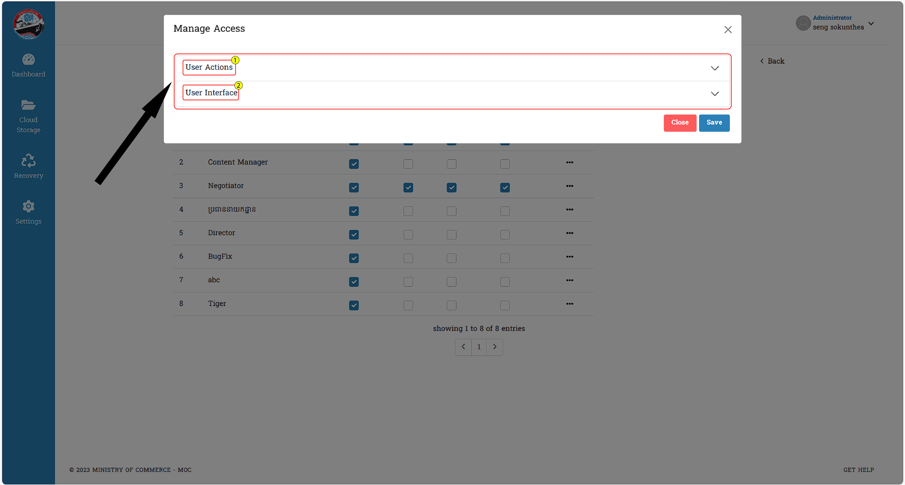

# I. Manage Access
នេះជាគេហទំព័រសម្រាប់អ្នកប្រើប្រាស់យល់ដឹងអំពីការគ្រប់គ្រងព័ត៌មានជាច្រើនក្នុង FTA Knowledge center ។ នេះជាព័ត៌មានដែលស្ថិតក្នុងគេហទំព័រ `Roles`
## ១. ការប្រើប្រាស់ Manage Access នៃ Roles

::: tip វិធីសាស្ត្រយល់ច្បាស់ជាមួយនឹងការប្រើប្រាស់ Manage Access

ការចូលទៅកាន់ Manage Access ព័ត៌មានទាំងអស់នឹងមានបង្ហាញ :
ព័ត៌មានចំនួន ២ គឺ 
- User Actions
- User Interface

>*User Actions* : រាល់ព័ត៌មានទាំងអស់អ្នកប្រើប្រាស់អាចមើលឃើញមុខងាផ្សេងៗ
បន្ថែមពីនោះចំណុច `READ` ជាចំណុចដែលអ្នកប្រើប្រាស់មិនអាចកែប្រែបាន

អ្នកប្រើប្រាស់អាចធ្វើការដក ឬ ដាក់នូវមុខងារទាំងអស់បានលើកលែងតែ `READ` តែប៉ុណ្ណោះ

>*User Interface* : អ្នកប្រើប្រាស់អាចធ្វើការកំណត់ព័ត៌មានលើចំណុចនីមួយៗ

- ចុច _Save_ ដើម្បីធ្វើការបញ្ជាក់ថាការចង់រក្សាទុក
- ចុច _Cancel_ សម្រាប់ទៅរកទម្រង់ដើម

:::