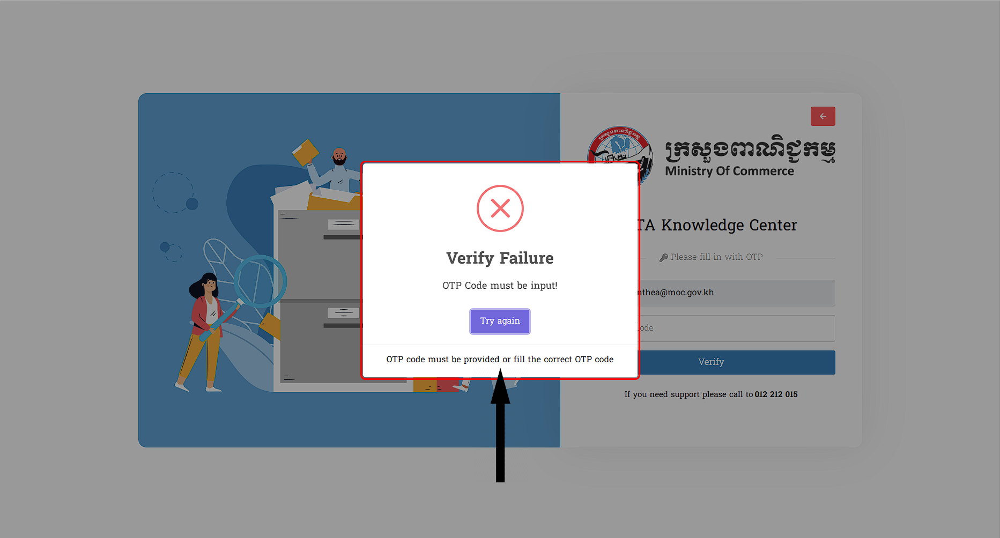

# III. ការប្រើលេខកូដសម្ងាត់តែម្តង (OTP)
នេះគឺជាព័ត៌មានទាំងអស់ក្នុងការស្វែងយល់ពីការប្រើប្រាស់មិនមានភាពត្រឹមត្រូវ ក្នុងករណីអ្នកប្រើប្រាស់ ដាក់ឈ្មោះ **Email** ត្រឹមត្រូវហើយ:

## ១. ការមិនផ្តល់ Code OTP ចូល
::: tip ករណីអ្នកប្រើប្រាស់មិនបានផ្តល់ Code OTP ចូលក្រោយពីបានទទួលនូវ Code នេះតាមរយ: Link ដែលបានផ្ញើរទៅកាន់ Email របស់អ្នកប្រើប្រាស់
- អ្នកប្រើប្រាស់តម្រូវឲ្យធ្វើការចូលទៅកាន់ Forgot Password 
- វាយឲ្យបានត្រឹមត្រូវនូវ Email របស់លោកអ្នក 
- ក្រោយ វាយចប់នឹងមាន Link Code មួយផ្ញើរទៅកាន់អ្នកប្រើប្រាស់

អ្នកប្រើប្រាស់មិនបានដាក់ Code នោះចូលទេ វាពិតណាស់នឹងមានបញ្ហាក្រោយពីបានចុច `Verify` រួច : 
 >សម្រាប់បញ្ហានោះគឺថា នឹងមានពាក្យមួយឃ្លាលោតមកឲ្យអ្នកប្រើប្រាស់ឃើញថា **OTP Code must be input!** ក្រោយពីអ្នកប្រើប្រាស់បានចុច ដំណើរការទៅកាន់ `Verify` ដែលមានក្រោមពាក្យ *Verify Failure*

 
:::