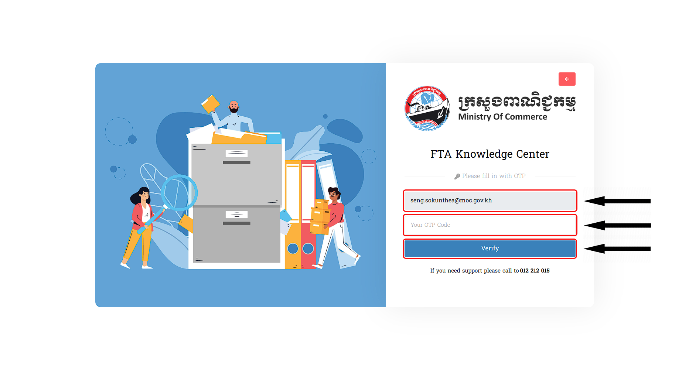

# III. ការប្រើលេខកូដសម្ងាត់ (OTP)
នេះគឺជាព័ត៌មានទាំងអស់ក្នុងការស្វែងយល់ពីការប្រើប្រាស់មិនមានភាពត្រឹមត្រូវ ក្នុងករណីអ្នកប្រើប្រាស់ ដាក់ឈ្មោះ **Email** ត្រឹមត្រូវហើយ:

## ១. ការដែលមិនដាក់ Code OTP ចូល
::: tip ករណីអ្នកប្រើប្រាស់មិនបានផ្តល់ Code OTP ចូលក្រោយពីបានទទួលនូវ Code នេះតាមរយ: Link ដែលបានផ្ញើរទៅកាន់ Email របស់អ្នកប្រើប្រាស់
- អ្នកប្រើប្រាស់តម្រូវឲ្យធ្វើការចូលទៅកាន់ `Forgot Password` 
- វាយឲ្យបានត្រឹមត្រូវនូវ Email របស់លោកអ្នក 
- ក្រោយវាយចប់សូមអ្នកប្រើប្រាស់ដាក់នូវ `Link Code` មួយផ្ញើរទៅកាន់អ្នកប្រើប្រាស់ក្នុង *MOC Mail*

សម្រាប់ Code OTP ត្រូវបានផ្តល់ទៅកាន់អ្នកប្រើប្រាស់នៅក្នុង Website របស់ក្រសួង *MOC Mail*  
អ្នកប្រើប្រាស់មិនបានដាក់ Code នោះចូលទេ វាពិតណាស់នឹងមានបញ្ហាក្រោយពីបានចុច `Verify` រួច : 
 >សម្រាប់បញ្ហានោះគឺថា នឹងមានពាក្យមួយឃ្លាលោតមកឲ្យអ្នកប្រើប្រាស់ឃើញថា **OTP Code must be input!** ដែលមានក្រោមពាក្យ *Verify Failure* ក្រោយពីអ្នកប្រើប្រាស់បានចុច ដំណើរការទៅកាន់ `Verify`

 
:::

## ២. ការដាក់ Code OTP ខុស

::: tip ករណីអ្នកប្រើប្រាស់ផ្តល់ Code OTP ចូលក្រោយពីបានទទួលនូវ Code នេះតាមរយ: Link ដែលបានផ្ញើរទៅកាន់ Email MOC Mail របស់អ្នកប្រើប្រាស់ ខុស
 >ចំពោះបញ្ហានេះមានបង្ហាញពាក្យមួយឃ្លាលោតមកឲ្យអ្នកប្រើប្រាស់ឃើញថា **Invalid OTP Code!** ដែលមានក្រោមពាក្យ *Verify Failure* ក្រោយពីអ្នកប្រើប្រាស់បានចុចដំណើរការទៅកាន់ `Verify` 

 
 ករណីថាអ្នកប្រើប្រាស់បញ្ចូលនូវពាក្យសម្ងាត់ ខុស មិនថាជា *អក្សរ* ​និង *លេខ* នោះទេ ។
 :::

