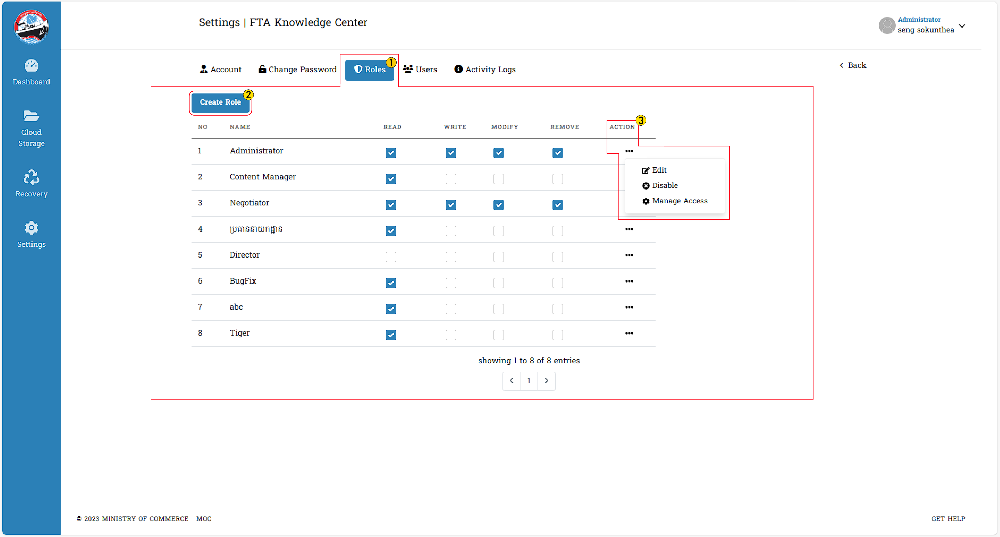
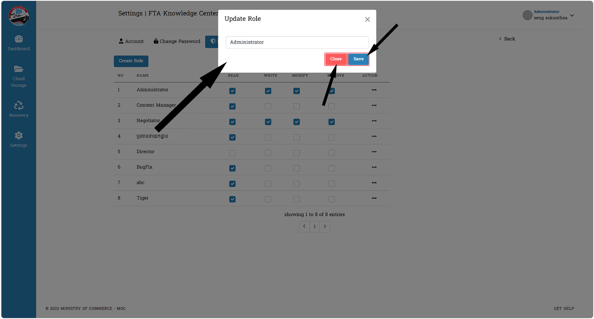
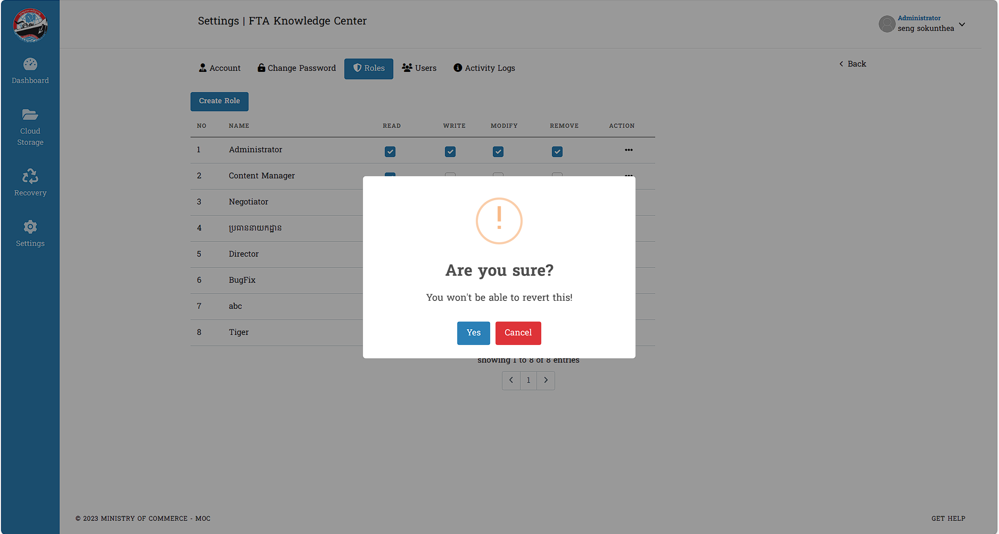

# III. Role

នេះគឺជា Role គឺជា «តួនាទី»  
អ្នកប្រើប្រាស់អាចធ្វើការកំណត់រាល់ `តួរនាទី` ទៅលើមុខងារមួយចំនួន :

**Create Role**

- Read (អាចអាន)
- Write (អាចសរសេរ)
- Modify (អាចកែកែប្រែ)
- Remove (អាចដកចេញ)
- Action (អាចធ្វើសកម្មភាពផ្សេងៗបានទៀត)

::: danger ការយល់ដឹងបន្ថែម
ក្រោយអ្នកប្រើប្រាស់ធ្វើការចុចលើ ( **・・・** )
ព័ត៌មាននឹងបង្ហាញ  :
- Edit
- Disable
- Manage Access
:::

នេះជាផ្ទាំងព័ត៌មានក្រោយពីអ្នកប្រើប្រាស់ចូលទៅកាន់គេហទំព័រ **Roles** រួចរាល់ :

## ១. ការស្វែងយល់ពីចំណុច Edit
::: tip វិធីសាស្ត្រយល់ដឹងអំពី Edit
អ្នកប្រើប្រាស់បានទទួលព័ត៌មាន **Update Role** ក្រោយពីចុច Edit រួច:
- អ្នកប្រើប្រាស់អាចធ្វើការផ្លាស់ប្តូរ ឈ្មោះ ( *Name Role* ) បាន

- អ្នកប្រើប្រាស់អាចចុច *Save* ដើម្បីទទួលយកអ្វីដែលអ្នកកែប្រែថ្មី
- ករណីមិនចង់កែប្រែទេ សូមធ្វើការចុច *Close* ជាការស្រេច

:::

## ២. ការប្រើប្រាស់​ Disable នៃ Roles
::: tip វិធីសាស្ត្រយល់ដឹងពី Disable លើ Roles
ដោយគ្រាន់តែអ្នកប្រើប្រាស់ធ្វើការចុចលើ *Disable* ព័ត៌មាននឹងបង្ហាញមកថា 
`Are you sure?` 
- អ្នកប្រើប្រាស់អាចចុច *Yes* ដើម្បីធ្វើការលុបចោល
- ករណីមិនចង់លុបទេ សូមធ្វើការចុច *Cancel* ជាការស្រេច

>បន្ទាប់ពីធ្វើការចុច `Yes` ក្នុង **Disable** រួចឃើញថា មុខងារដែលអ្នកប្រើប្រាស់ចង់លុបចេញ បានជោគជ័យ ✅
:::

## ៣. ការប្រើប្រាស់ Manage Access នៃ Roles
## ៤sdfas
## ៥ 

>**Edit** : ការកំណត់មុខងារផ្សេងៗក្នុងប្រព័ន្ធ ( *ចំណុចនេះមានសិទ្ធសម្រាប់តែ Admin តែប៉ុណ្ណោះ* ) ។

>**Disable** : អ្នកប្រើប្រាស់អាចធ្វើការបិទមុខងារណាមួយដែលខ្លួនមិនពេញចិត្តបាន ()