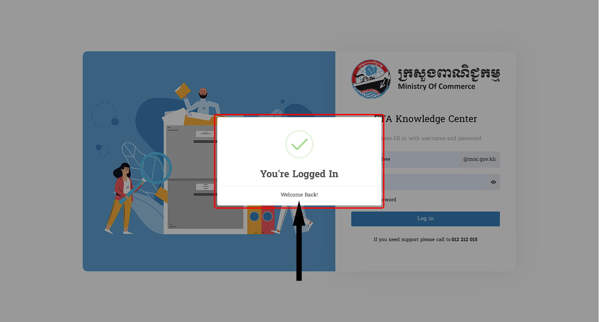

# ១. ការបញ្ចូលទាំង Username & Password

ការបញ្ចូលនូវ `Username` និង `Password` មានលក្ខណ:ត្រឹមត្រូវវាចាំបាច់អ្នកប្រើប្រាស់ធ្វើតាមការណែរបៀបនេះ នោះវានឹងបង្ហាញព័ត៌មានដូចមានខាងក្រោមនេះ :
::: tip ការបញ្ចូលទាំងឈ្មោះ និង ពាក្យសម្ងាត់ ត្រឹមត្រូវ
> បើវាយត្រឹមត្រូវ នឹងមានពាក្យថា **Your're Logged In** 

:::
# ២.