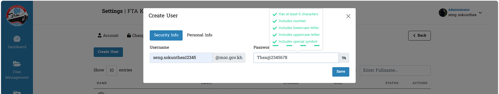
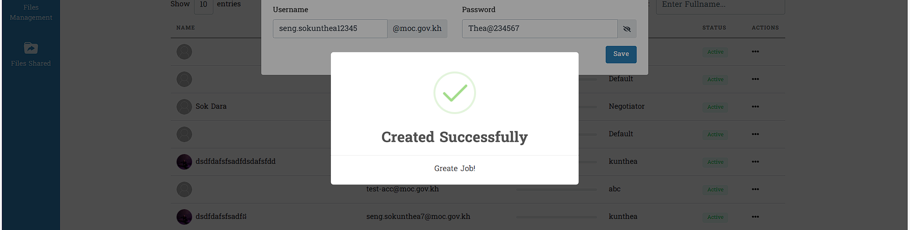

# I. Users នៅក្នុង Settings

&nbsp;&nbsp;&nbsp;&nbsp;&nbsp;&nbsp;&nbsp;&nbsp;អនុញ្ញាតគ្រប់សកម្មភាពដល់អ្នកប្រើប្រាស់សម្រាប់ព័ត៌មានដែលមានក្នុង **User Interface** ។ ព័ត៌មានទាំងអស់មានទំនាក់ទំនងជាមួយ **User Permission** សម្រាប់ការកំណត់ដល់អ្នកប្រើប្រាស់ឲ្យមានលក្ខណ:ភាពច្បាស់លាស់លើចំណុចផ្សេងៗដែល `Admin` ត្រូវការកំណត់ឲ្យអ្នកប្រើប្រាស់មានសកម្មភាព ។

## ១. ការបង្កើតអ្នកប្រើប្រាស់ថ្មី (Create User)
&nbsp;&nbsp;&nbsp;&nbsp;&nbsp;&nbsp;&nbsp;&nbsp;នៅពេលអ្នកចុចបើកមើលក្នុង **Create User** យើងបានឃើញនូវព័ត៌មាន `Security info` និង `Personal info` របស់អ្នកប្រើប្រាស់ ក្នុងការបង្កើតនូវព័ត៌មានថ្មី ដោយគ្រាន់តែលុបនូវព័ត៌មានអ្នកចាស់ចេញតែប៉ុណ្ណោះ ។ ប៉ុន្តែចំពោះ ព័ត៌មានណាដែលធ្លាប់បានដាក់ពីមុន ឬ ព័ត៌មានដែលមានពីមុនមិនអាចធ្វើការផ្តល់ឡើងវិញបានទេ ។

> របៀបបង្កើត : 
> - ចុចចូល Users ក្នុង Settings
> - ចុចលើ Create User 
> - ចុចដាក់ឈ្មោះ Username និង ពាក្យសម្ងាត់ Password

- ព័ត៌មាន `Security Info` : គឺជាព័ត៌មានសុវត្តិភាពរបស់អ្នកប្រើប្រាស់ រួមមាន *Username* និង *Password* ។
- ព័ត៌មាន `Personal Info` : ជាកន្លែងដែលអ្នកប្រើប្រាស់ចាំបាច់ត្រូវធ្វើការបំពេញតាមលក្ខខណ្ឌផ្សេងៗ ។

## ២. ការកំណត់ឈ្មោះ និង ពាក្យសម្ងាត់ (Username & Password)
&nbsp;&nbsp;&nbsp;&nbsp;&nbsp;&nbsp;&nbsp;&nbsp;ការបង្កើតព័ត៌មានថ្មីរបស់អ្នកប្រើប្រាស់ ឬ **Create User** នៅក្នុង `Security Info` ។ ការដាក់ពាក្យសម្ងាត់ថ្មីអ្នកប្រើប្រាស់ចាំបាច់យ៉ាងហោចណាស់ត្រូវមានតួរពិសេសមួយ អក្សរធំមួយ លេខមួយ ដោយសរុបជាប្រវែងអប្បបរមា ៦ តួរឡើង​ ។

> របៀបបង្កើត : 
> - ពាក្យសម្ងាត់ត្រូវមានសញ្ញាពិសេស
> - ពាក្យសម្ងាត់យ៉ាងហោចណាស់ត្រូវមានតួរអក្សរធំមួយ
> - ពាក្យសម្ងាត់ត្រូវមានចំនួន 6 តួរអក្សរយ៉ាងតិច
> - ពាក្យសម្ងាត់យ៉ាងហោចណាស់ត្រូវមានលេខចំនួនមួយតួរយ៉ាងតិច
>
> 

- ក្រោយពីអ្នកប្រើប្រាស់បានផ្លាស់ប្តូរឬបង្កើតថ្មី វានឹងមានការបង្ហាញពាក្យថា **created successfully** ដើម្បីជាសញ្ញាបង្ហាញថាអ្នកបានផ្លាស់ប្តូរ ឬបង្កើតថ្មីដោយជោគជ័យ ។

::: warning ចំណាំ
&nbsp;&nbsp;&nbsp;&nbsp;&nbsp;&nbsp;&nbsp;&nbsp;ក្រោយការបង្កើតអ្នកប្រើប្រាស់ថ្មីរួច ឬ **Create User** ហើយ គេហទំព័រនោះនឹងបង្ហាញជាទម្រង់ដើម ដោយបង្ហាញត្រឹមតែ *Settings* ប៉ុណ្ណោះ ។ ការដែលក្លាយជាទម្រង់ដើមនេះផងដែរ ក្នុង *Settings* អាចកែប្រែព័ត៌មានរបស់ខ្លួន (Profile Account) និង ការផ្លាស់ប្តូរពាក្យសម្ងាត់របស់ខ្លួន (Change Password) ។
:::