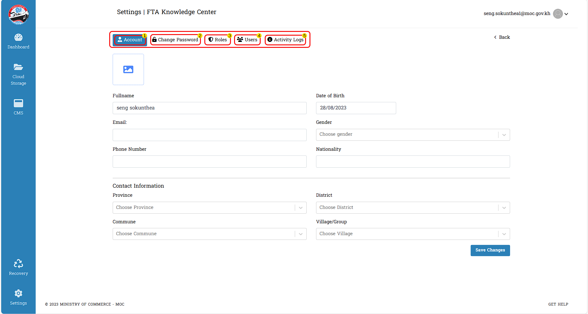

# I. SETTINGS

នេះគឺជាព័ត៌មានផ្ទាល់ខ្លួនរបស់អ្នកប្រើប្រាស់ទាំងអស់ក្នុងប្រព័ន្ធ FTA Knowledge Center ដែលអា្នកប្រើប្រាស់អាចធ្វើការផ្លាស់ប្តូរចំណុចទាំង ៥ គឺ :
1. ព័ត៌មានផ្ទាល់ខ្លួនរបស់អ្នកប្រើប្រាស់ *Account*
2. ការផ្លាស់ប្តូរពាក្យសំងាត់ *Change Password*
3. កំណត់លើតួនាទីឬមុខងារណាមួយ *Roles*
4. ព័ត៌មានអ្នកប្រើប្រាស់ *Users*
5. កំណត់រាល់ការប្រើប្រាស់ផ្សេងៗ *Activity Logs*

## 1. Account
ព័ត៌មានផ្ទាល់ខ្លួនយ៉ាងសំខាន់សម្រាប់អ្នកប្រើប្រាស់គួរមានការកំណត់ឲ្យមានភាពត្រឹមត្រូវជាចាំបាច់ ក្នងគេហទំព័រនេះអ្នកប្រើប្រាស់អាចធ្វើការកំណត់ដូចជា :
- ដាក់ឬលុបចោលរូបភាព Profile
- បំពេញព័ត៌មានផ្ទាល់ខ្លួនផ្សេងៗ

 >អ្នកប្រើប្រាស់ត្រូវបំពេញក្នុងចំណុចទាំង ១០ ដែលមានដូចបានគូសចំណាំនេះ :

ធ្វើការចុច Save Change ជាចំណុចចុងក្រោយសម្រាប់អ្នកប្រើប្រាស់ចង់រក្សាព័ត៌មានដែលបានបំពេញរួចទុក

### ១. ការលុបចោលរូបភាព Profile ចេញ
::: tip វិធីសាស្ត្រក្នុងការលុបចោលនៃរូបភាពរបស់ Profile
សម្រាប់ការដែលអ្នកប្រើប្រាស់ចង់ធ្វើការលុបចោលនូវរូបភាពនៃ Profile : 

- ចុចលើពាក្យថា `Remove` ដើម្បីលុបចោលនូវរូបភាព *Profile*
:::

### ២. ការដាក់រូបភាព Profile 
::: tip វិធីសាស្ត្រក្នុងការដាក់រូបភាពរបស់ Profile
ការដាក់នូវរូបភាពសម្រាប់បង្ហាញលើប្រវត្តិព័ត៌មានផ្ទាល់ខ្លូនរបស់អ្នកប្រើប្រាស់មានលក្ខណ: : 

- ធ្វើការចុចលើចំណុចនេះ ១ ដង នោះអ្នកប្រើប្រាស់នឹងចូលទៅកាន់ `File​ Explorer`
- អ្នកប្រើប្រាស់អាចជ្រើសរើសទីតាំងនៃរូបភាពដែលខ្លួនពេញចិត្តដើម្បីដាក់ជា *Profile*
:::